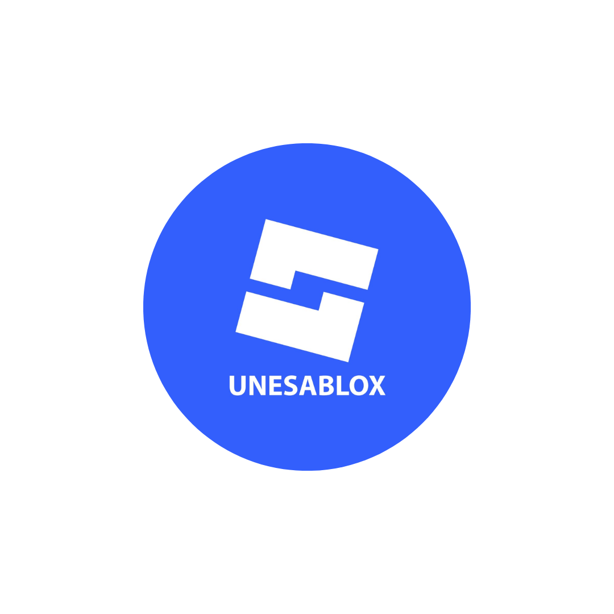
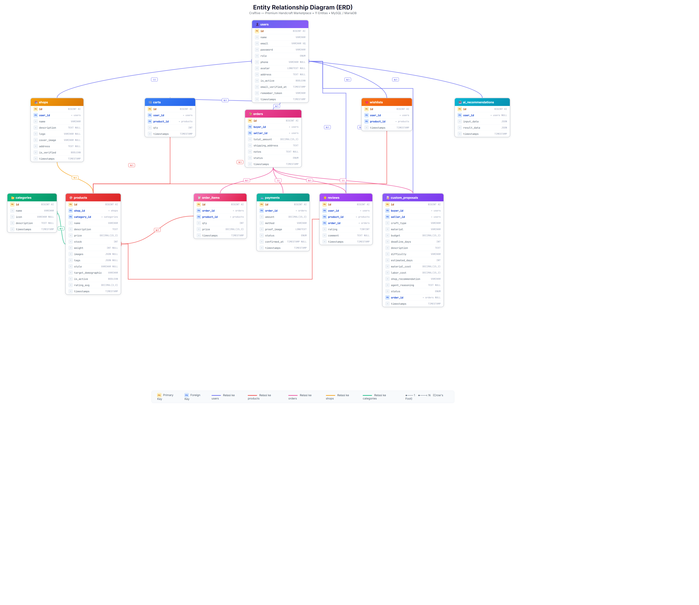
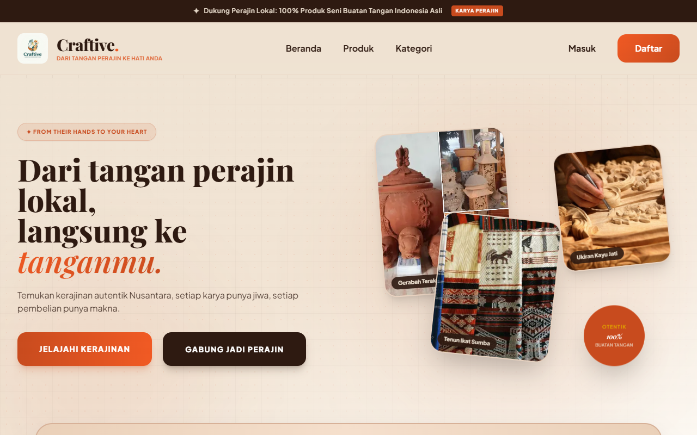
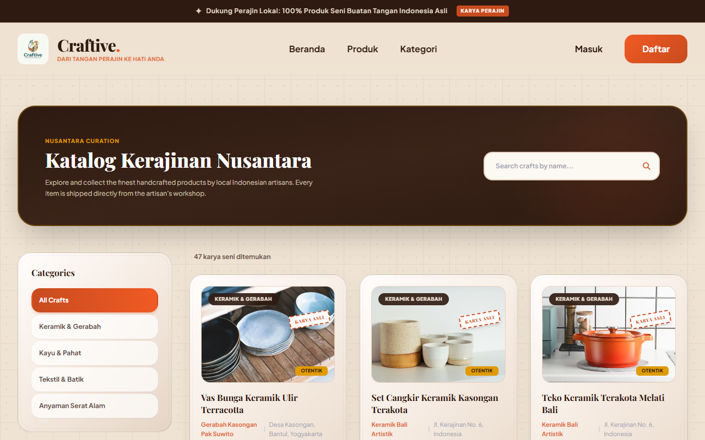
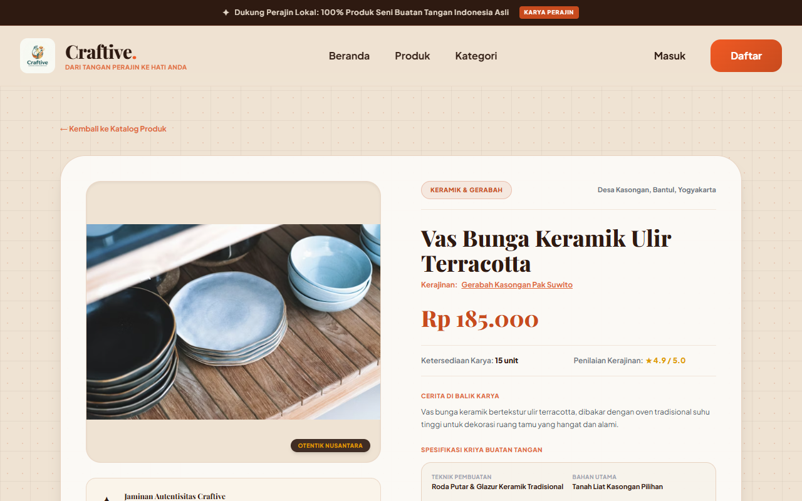
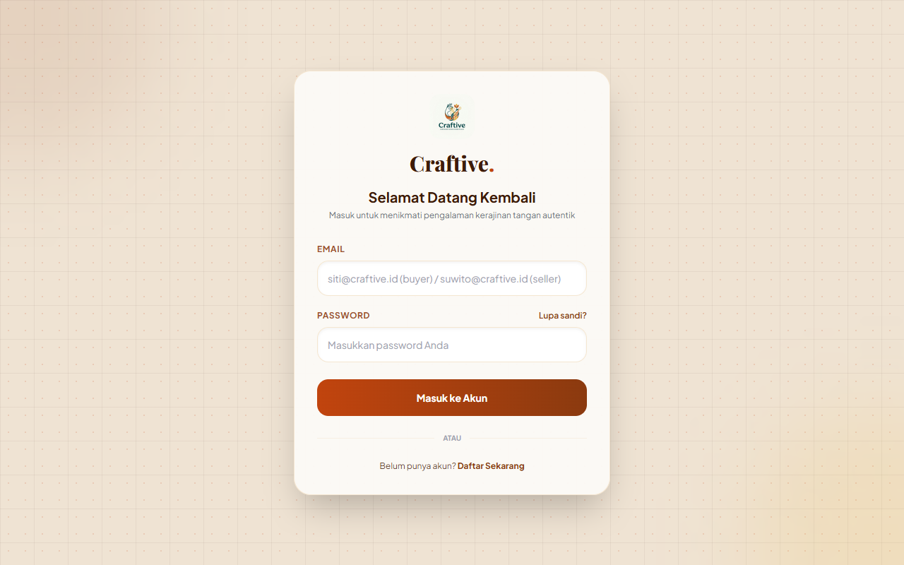
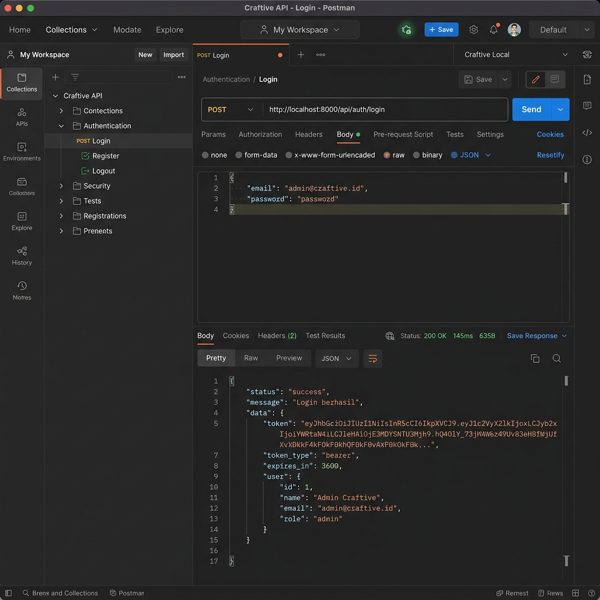
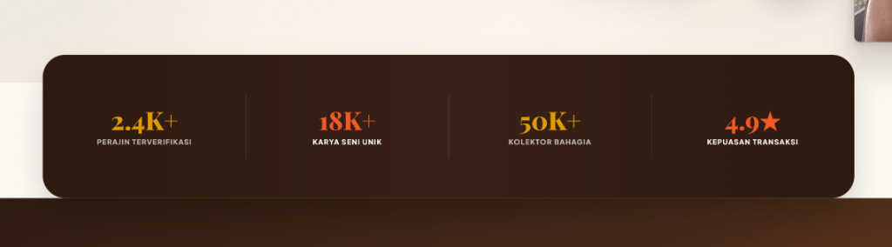
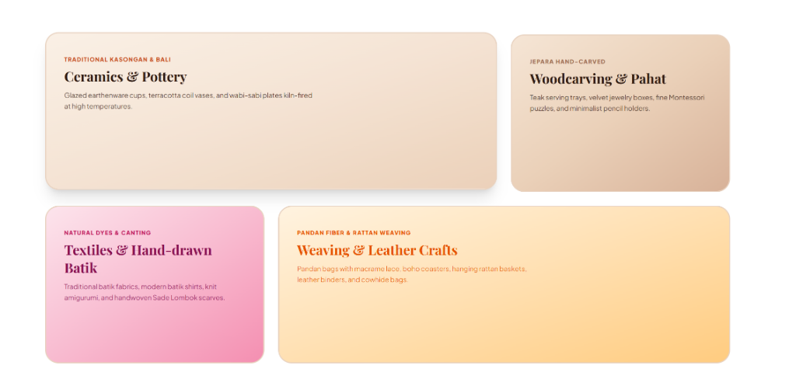
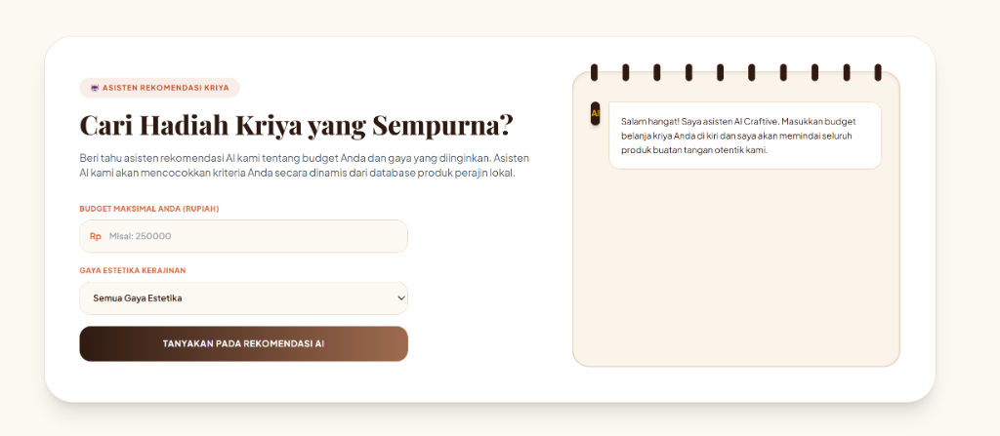

<div class="page cover-page spasi-single">
<div class="cover-content" style="display: flex; flex-direction: column; justify-content: space-between; height: 100%; box-sizing: border-box; padding: 1cm 0;">
<div class="cover-header" style="text-align: center;">
<h2 style="font-family: 'Outfit', sans-serif; font-size: 16pt; font-weight: 700; margin: 0; color: #2C2C2C; text-transform: uppercase; letter-spacing: 1.5px; line-height: 1.3;">LAPORAN TUGAS AKHIR</h2>
<h1 style="font-family: 'Outfit', sans-serif; font-size: 20pt; font-weight: 800; margin: 15px 0 0 0; color: #C84B1E; text-transform: uppercase; letter-spacing: 1px; line-height: 1.3;">APLIKASI WEBSITE CRAFTIVE</h1>
<p style="font-family: 'Plus Jakarta Sans', sans-serif; font-size: 11pt; color: #666; margin: 10px 0 0 0; font-style: italic; font-weight: 500;">(Premium Handmade Goods Marketplace & REST API with Agentic AI Custom Planner)</p>
</div>

<div class="cover-logo" style="text-align: center; margin: 1.5cm 0;">

</div>

<div class="cover-details" style="text-align: center; margin-bottom: 1.5cm;">
<p style="font-family: 'Outfit', sans-serif; font-size: 12pt; font-weight: 600; color: #2C2C2C; margin: 0 0 5px 0; text-transform: uppercase; letter-spacing: 0.5px;">Proyek Akhir Matakuliah Pemrograman API</p>
<p style="font-family: 'Outfit', sans-serif; font-size: 11pt; font-weight: 500; color: #666; margin: 0 0 15px 0; text-transform: uppercase; letter-spacing: 0.5px;">Semester Genap &bull; Tahun Akademik 2025/2026</p>
<p style="font-family: 'Outfit', sans-serif; font-size: 12pt; font-weight: 600; color: #C84B1E; margin: 0 0 1.2cm 0;">Dosen Pengampu: M Adamu Islam Mashuri, S.Tr.T., M.Tr.Kom</p>

<div style="display: flex; flex-direction: column; align-items: center; gap: 8px; margin-bottom: 1.2cm;">
<p style="font-family: 'Outfit', sans-serif; font-size: 11pt; font-weight: 500; color: #2C2C2C; margin: 0; text-transform: uppercase; letter-spacing: 0.5px;">Disusun Oleh:</p>
<table style="width: auto; margin: 5px auto; border-collapse: collapse; border: none;">
<tr style="background: none;">
<td style="padding: 4px 15px; border: none; font-family: 'Fira Code', monospace; font-size: 11pt; font-weight: 600; color: #2C2C2C; text-align: right;">24091397145</td>
<td style="padding: 4px 15px; border: none; font-family: 'Outfit', sans-serif; font-size: 11pt; font-weight: 600; color: #C84B1E; text-align: left;">Selvi Adinda H.</td>
</tr>
</table>
</div>

<p style="font-family: 'Outfit', sans-serif; font-size: 11pt; font-weight: 500; color: #2C2C2C; margin: 0;">Tanggal Pengumpulan: 8 Juni 2026</p>
</div>

<div class="cover-footer" style="text-align: center; font-family: 'Outfit', sans-serif; font-size: 12pt; font-weight: 700; color: #2C2C2C; text-transform: uppercase; line-height: 1.5; letter-spacing: 0.5px; border-top: 2px solid #FDF4F0; padding-top: 1cm;">
PROGRAM STUDI MANAJEMEN INFORMATIKA<br>
FAKULTAS VOKASI<br>
UNIVERSITAS NEGERI SURABAYA<br>
2026
</div>
</div>
</div>

<div class="page spasi-single">
<div style="text-align: center; margin-bottom: 1.5cm;">
<h2 style="font-family: 'Outfit', sans-serif; font-size: 14pt; font-weight: 700; color: #2C2C2C; text-transform: uppercase; letter-spacing: 1px; margin: 0;">ABSTRAKSI</h2>
</div>

<p style="text-align: justify; text-indent: 1.25cm; margin-bottom: 1.5em; font-family: 'Times New Roman', Times, serif; font-size: 12pt; line-height: 1.5;">
Perkembangan industri kreatif kriya di Indonesia saat ini menghadapi tantangan besar akibat penetrasi produk massal impor di berbagai platform e-commerce konvensional. Hal ini memicu penurunan minat konsumen terhadap produk buatan tangan (handmade) yang otentik dan memiliki nilai budaya tinggi. Penelitian ini bertujuan untuk merancang dan mengimplementasikan Craftive, sebuah platform marketplace berbasis website terintegrasi REST API yang dikhususkan untuk produk kriya premium buatan tangan seniman lokal. Craftive dilengkapi dengan fitur unggulan Agentic AI Custom Planner yang berfungsi sebagai asisten negosiasi dinamis untuk membantu pembeli menyimulasikan rincian biaya material, jasa perajin, dan waktu pengerjaan kerajinan kustom secara transparan.
</p>

<p style="text-align: justify; text-indent: 1.25cm; margin-bottom: 1.5em; font-family: 'Times New Roman', Times, serif; font-size: 12pt; line-height: 1.5;">
Sistem keamanan REST API pada platform ini dirancang menggunakan arsitektur tiga lapis, yaitu JSON Web Token (JWT) untuk mengamankan transaksi sensitif, API Key statis untuk memproteksi katalog publik dari aktivitas scraping data massal, dan HTTP Basic Authentication untuk akses cepat data profil dasar. Selain itu, sistem otorisasi berbasis peran (Role-Based Access Control) dan Strict Order Workflow diimplementasikan guna memastikan integritas transaksi antara pembeli, penjual (perajin), dan administrator. Pengujian fungsionalitas dan keamanan API dilakukan menggunakan Postman, yang membuktikan bahwa seluruh endpoint REST API terlindungi dan berfungsi sesuai skenario bisnis. Hasil analisis usability testing terhadap lima responden menunjukkan tingkat kepuasan rata-rata yang tinggi (skala 4.2 dari 5.0) terhadap kemudahan transaksi dan transparansi kalkulator kustom AI. Platform Craftive diharapkan mampu menjadi wadah digital premium yang menaikkan daya saing perajin lokal di pasar modern.
</p>

<p style="font-family: 'Times New Roman', Times, serif; font-size: 12pt; line-height: 1.5; margin-top: 1cm;">
<strong>Kata Kunci:</strong> REST API, Laravel, JSON Web Token, Agentic AI Planner, Marketplace Kriya, Usability Testing
</p>

<div class="page-footer">ii</div>
</div>

<div class="page spasi-single">
<div style="text-align: center; margin-bottom: 1.5cm;">
<h2 style="font-family: 'Outfit', sans-serif; font-size: 14pt; font-weight: 700; color: #2C2C2C; text-transform: uppercase; letter-spacing: 1px; margin: 0;">ABSTRACT</h2>
</div>

<p style="text-align: justify; text-indent: 1.25cm; margin-bottom: 1.5em; font-family: 'Times New Roman', Times, serif; font-size: 12pt; line-height: 1.5; font-style: italic;">
The development of the creative craft industry in Indonesia currently faces significant challenges due to the penetration of imported mass-produced goods in conventional e-commerce platforms. This has triggered a decline in consumer interest toward authentic handmade products that possess high cultural value. This study aims to design and implement Craftive, a website-based marketplace platform integrated with a REST API dedicated to premium handmade craft products by local artisans. Craftive is equipped with a flagship feature called the Agentic AI Custom Planner, which functions as a dynamic negotiation assistant to help buyers simulate material cost breakdowns, artisan labor fees, and custom craft production times transparently.
</p>

<p style="text-align: justify; text-indent: 1.25cm; margin-bottom: 1.5em; font-family: 'Times New Roman', Times, serif; font-size: 12pt; line-height: 1.5; font-style: italic;">
The REST API security system on this platform is designed using a three-layer architecture: JSON Web Tokens (JWT) to secure sensitive transactions, a static API Key to protect the public catalog from mass scraping activities, and HTTP Basic Authentication for fast basic profile data access. Furthermore, Role-Based Access Control (RBAC) and a Strict Order Workflow are implemented to ensure transaction integrity among buyers, sellers (artisans), and administrators. API functionality and security testing were conducted using Postman, proving that all REST API endpoints are secured and function according to the business scenarios. The usability testing analysis of five respondents showed a high average satisfaction rate (4.2 out of 5.0 scale) regarding transaction ease and the transparency of the AI custom calculator. The Craftive platform is expected to serve as a premium digital hub that enhances the competitiveness of local artisans in the modern market.
</p>

<p style="font-family: 'Times New Roman', Times, serif; font-size: 12pt; line-height: 1.5; margin-top: 1cm; font-style: italic;">
<strong>Keywords:</strong> REST API, Laravel, JSON Web Token, Agentic AI Planner, Craft Marketplace, Usability Testing
</p>

<div class="page-footer">iii</div>
</div>

<div class="page spasi-single">
<div style="text-align: center; margin-bottom: 1.5cm;">
<h2 style="font-family: 'Outfit', sans-serif; font-size: 14pt; font-weight: 700; color: #2C2C2C; text-transform: uppercase; letter-spacing: 1px; margin: 0;">DAFTAR ISI</h2>
</div>

<div class="daftar-isi-container" style="font-family: 'Times New Roman', Times, serif; font-size: 12pt; line-height: 2.0; margin-top: 1cm;">
<div style="display: flex; justify-content: space-between; align-items: flex-end; margin-bottom: 8px;">
<span>HALAMAN COVER</span>
<span style="flex-grow: 1; border-bottom: 1px dotted #ccc; margin: 0 10px 4px 10px;"></span>
<span>i</span>
</div>
<div style="display: flex; justify-content: space-between; align-items: flex-end; margin-bottom: 8px;">
<span>ABSTRAKSI (Bahasa Indonesia)</span>
<span style="flex-grow: 1; border-bottom: 1px dotted #ccc; margin: 0 10px 4px 10px;"></span>
<span>ii</span>
</div>
<div style="display: flex; justify-content: space-between; align-items: flex-end; margin-bottom: 8px;">
<span>ABSTRACT (Bahasa Inggris)</span>
<span style="flex-grow: 1; border-bottom: 1px dotted #ccc; margin: 0 10px 4px 10px;"></span>
<span>iii</span>
</div>
<div style="display: flex; justify-content: space-between; align-items: flex-end; margin-bottom: 8px;">
<span>DAFTAR ISI</span>
<span style="flex-grow: 1; border-bottom: 1px dotted #ccc; margin: 0 10px 4px 10px;"></span>
<span>iv</span>
</div>
<div style="display: flex; justify-content: space-between; align-items: flex-end; margin-bottom: 8px; font-weight: bold;">
<span>BAB 1: PENDAHULUAN</span>
<span style="flex-grow: 1; border-bottom: 1px dotted #ccc; margin: 0 10px 4px 10px;"></span>
<span>1</span>
</div>
<div style="display: flex; justify-content: space-between; align-items: flex-end; margin-left: 20px; margin-bottom: 8px;">
<span>1.1. Latar Belakang Masalah</span>
<span style="flex-grow: 1; border-bottom: 1px dotted #ccc; margin: 0 10px 4px 10px;"></span>
<span>1</span>
</div>
<div style="display: flex; justify-content: space-between; align-items: flex-end; margin-left: 20px; margin-bottom: 8px;">
<span>1.2. Rumusan Masalah</span>
<span style="flex-grow: 1; border-bottom: 1px dotted #ccc; margin: 0 10px 4px 10px;"></span>
<span>2</span>
</div>
<div style="display: flex; justify-content: space-between; align-items: flex-end; margin-left: 20px; margin-bottom: 8px;">
<span>1.3. Tujuan Dibuatnya Aplikasi</span>
<span style="flex-grow: 1; border-bottom: 1px dotted #ccc; margin: 0 10px 4px 10px;"></span>
<span>3</span>
</div>
<div style="display: flex; justify-content: space-between; align-items: flex-end; margin-bottom: 8px; font-weight: bold;">
<span>BAB 2: PEMBAHASAN</span>
<span style="flex-grow: 1; border-bottom: 1px dotted #ccc; margin: 0 10px 4px 10px;"></span>
<span>4</span>
</div>
<div style="display: flex; justify-content: space-between; align-items: flex-end; margin-left: 20px; margin-bottom: 8px;">
<span>2.1. Deskripsi Platform & Arsitektur API</span>
<span style="flex-grow: 1; border-bottom: 1px dotted #ccc; margin: 0 10px 4px 10px;"></span>
<span>4</span>
</div>
<div style="display: flex; justify-content: space-between; align-items: flex-end; margin-left: 20px; margin-bottom: 8px;">
<span>2.2. Fitur-fitur Utama & Cara Kerja</span>
<span style="flex-grow: 1; border-bottom: 1px dotted #ccc; margin: 0 10px 4px 10px;"></span>
<span>6</span>
</div>
<div style="display: flex; justify-content: space-between; align-items: flex-end; margin-left: 20px; margin-bottom: 8px;">
<span>2.3. Keamanan & Autentikasi API</span>
<span style="flex-grow: 1; border-bottom: 1px dotted #ccc; margin: 0 10px 4px 10px;"></span>
<span>8</span>
</div>
<div style="display: flex; justify-content: space-between; align-items: flex-end; margin-left: 20px; margin-bottom: 8px;">
<span>2.4. CRUD Endpoints Platform</span>
<span style="flex-grow: 1; border-bottom: 1px dotted #ccc; margin: 0 10px 4px 10px;"></span>
<span>11</span>
</div>
<div style="display: flex; justify-content: space-between; align-items: flex-end; margin-left: 20px; margin-bottom: 8px;">
<span>2.5. Entity Relationship Diagram (ERD)</span>
<span style="flex-grow: 1; border-bottom: 1px dotted #ccc; margin: 0 10px 4px 10px;"></span>
<span>12</span>
</div>
<div style="display: flex; justify-content: space-between; align-items: flex-end; margin-left: 20px; margin-bottom: 8px;">
<span>2.6. User Interface & Alur Navigasi</span>
<span style="flex-grow: 1; border-bottom: 1px dotted #ccc; margin: 0 10px 4px 10px;"></span>
<span>14</span>
</div>
<div style="display: flex; justify-content: space-between; align-items: flex-end; margin-left: 20px; margin-bottom: 8px;">
<span>2.7. Pengujian API dengan Postman</span>
<span style="flex-grow: 1; border-bottom: 1px dotted #ccc; margin: 0 10px 4px 10px;"></span>
<span>17</span>
</div>
<div style="display: flex; justify-content: space-between; align-items: flex-end; margin-bottom: 8px; font-weight: bold;">
<span>BAB 3: PENUTUP</span>
<span style="flex-grow: 1; border-bottom: 1px dotted #ccc; margin: 0 10px 4px 10px;"></span>
<span>20</span>
</div>
<div style="display: flex; justify-content: space-between; align-items: flex-end; margin-left: 20px; margin-bottom: 8px;">
<span>3.1. Kesimpulan</span>
<span style="flex-grow: 1; border-bottom: 1px dotted #ccc; margin: 0 10px 4px 10px;"></span>
<span>20</span>
</div>
<div style="display: flex; justify-content: space-between; align-items: flex-end; margin-left: 20px; margin-bottom: 8px;">
<span>3.2. Saran</span>
<span style="flex-grow: 1; border-bottom: 1px dotted #ccc; margin: 0 10px 4px 10px;"></span>
<span>20</span>
</div>
<div style="display: flex; justify-content: space-between; align-items: flex-end; margin-bottom: 8px; font-weight: bold;">
<span>DAFTAR PUSTAKA</span>
<span style="flex-grow: 1; border-bottom: 1px dotted #ccc; margin: 0 10px 4px 10px;"></span>
<span>21</span>
</div>
<div style="display: flex; justify-content: space-between; align-items: flex-end; margin-bottom: 8px; font-weight: bold;">
<span>DATA DIRI TIM</span>
<span style="flex-grow: 1; border-bottom: 1px dotted #ccc; margin: 0 10px 4px 10px;"></span>
<span>22</span>
</div>
<div style="display: flex; justify-content: space-between; align-items: flex-end; margin-bottom: 8px; font-weight: bold;">
<span>LAMPIRAN</span>
<span style="flex-grow: 1; border-bottom: 1px dotted #ccc; margin: 0 10px 4px 10px;"></span>
<span>23</span>
</div>
</div>

<div class="page-footer">iv</div>
</div>

<div class="page spasi-double">
<div style="text-align: center; margin-bottom: 1.5cm;">
<h2 style="font-family: 'Outfit', sans-serif; font-size: 14pt; font-weight: 700; color: #2C2C2C; text-transform: uppercase; letter-spacing: 1px; margin: 0;">BAB 1<br>PENDAHULUAN</h2>
</div>

<h3 style="font-family: 'Outfit', sans-serif; font-size: 12pt; font-weight: 700; color: #2C2C2C; margin-top: 0; margin-bottom: 10px;">1.1. Latar Belakang Masalah</h3>

<p style="text-align: justify; text-indent: 1.25cm; margin-bottom: 1em; font-family: 'Times New Roman', Times, serif; font-size: 12pt; line-height: 2.0;">
Indonesia dianugerahi kekayaan seni budaya kriya tradisional yang tak ternilai, mencakup berbagai produk buatan tangan mulai dari gerabah tanah liat, ukiran kayu jati, tenun tradisional, hingga kerajinan anyaman serat alam. Keberadaan industri kreatif kriya mikro, kecil, dan menengah (UMKM) ini menjadi salah satu tulang punggung perekonomian masyarakat lokal di berbagai wilayah Indonesia. Namun, seiring dengan masifnya peralihan transaksi ke platform digital (e-commerce), kelangsungan ekonomi para perajin kriya lokal kini terancam oleh serbuan produk manufaktur impor massal. Di platform e-commerce konvensional, produk buatan tangan otentik yang membutuhkan proses pengerjaan manual selama berhari-hari harus bersaing harga secara tidak sehat dengan barang cetakan pabrik berbahan plastik/sintetis yang diimpor secara murah. Fenomena ini mempersulit konsumen premium dalam menyaring dan mengapresiasi keaslian serta nilai estetika kriya lokal yang sebenarnya.
</p>

<p style="text-align: justify; text-indent: 1.25cm; margin-bottom: 1em; font-family: 'Times New Roman', Times, serif; font-size: 12pt; line-height: 2.0;">
Selain tantangan kompetisi harga, perajin kriya lokal juga menghadapi kendala dalam digitalisasi operasional dan proses bisnis kustomisasi. Sebagian besar seniman tradisional merupakan pelaku usaha mikro dengan literasi teknologi terbatas yang kesulitan mengelola sistem inventori e-commerce yang rumit. Di sisi lain, konsumen premium yang ingin melakukan pemesanan produk kriya kustom sering kali terhambat oleh proses negosiasi harga dan estimasi durasi pengerjaan yang tidak transparan dan tidak terstandarisasi. Untuk memecahkan kebuntuan ini, diperlukan sebuah platform e-commerce terdedikasi yang mampu menyajikan pengalaman branding premium bagi produk kriya otentik, memfasilitasi negosiasi kustom secara pintar, dan menyediakan layanan sistem API (Application Programming Interface) yang aman.
</p>

<div class="page-footer">1</div>
</div>

<div class="page spasi-single">
<p style="text-align: justify; text-indent: 1.25cm; margin-bottom: 0.8em; font-family: 'Times New Roman', Times, serif; font-size: 12pt;">
Melalui mata kuliah Pemrograman API, dirancanglah platform website <strong>Craftive</strong> sebagai solusi terpadu untuk mendongkrak ekosistem kriya premium Indonesia. Platform ini mengintegrasikan kecerdasan buatan berbasis agen (Agentic AI) yang berperan sebagai asisten perencanaan kriya kustom (AI Custom Planner) untuk menghitung estimasi biaya bahan baku, jasa perajin, dan waktu pengerjaan secara objektif dan real-time. Guna menjaga aspek keamanan data transaksi dan stabilitas sistem, seluruh arsitektur REST API platform Craftive dirancang dengan tiga lapis otentikasi (JWT Token, API Key, dan Basic Auth) serta menerapkan sistem kontrol akses berbasis peran (RBAC) yang ketat.
</p>

<h3 style="font-family: 'Outfit', sans-serif; font-size: 12pt; font-weight: 700; color: #2C2C2C; margin-top: 0.8em; margin-bottom: 4px;">1.2. Rumusan Masalah</h3>

<p style="text-align: justify; margin-bottom: 4px; font-family: 'Times New Roman', Times, serif; font-size: 12pt;">
Berdasarkan latar belakang masalah yang telah diuraikan, maka rumusan masalah dalam pengembangan proyek ini adalah sebagai berikut:
</p>

<ol style="font-family: 'Times New Roman', Times, serif; font-size: 12pt; padding-left: 20px; margin-bottom: 0.8em;">
<li style="text-align: justify; margin-bottom: 4px;">Bagaimana membangun platform e-commerce yang bersih, responsif, dan terdedikasi khusus untuk produk kerajinan kriya tradisional premium buatan tangan seniman lokal?</li>
<li style="text-align: justify; margin-bottom: 4px;">Bagaimana merancang sistem asisten perencanaan kriya kustom berbasis Agentic AI (AI Custom Planner) yang mampu menghitung biaya material, jasa perajin, durasi pengerjaan, dan tingkat kesulitan secara dinamis?</li>
<li style="text-align: justify; margin-bottom: 4px;">Bagaimana mengimplementasikan arsitektur keamanan REST API tiga lapis (JSON Web Token, API Key, dan Basic Authentication) beserta skema kontrol akses berbasis peran (RBAC) pada framework Laravel?</li>
<li style="text-align: justify; margin-bottom: 4px;">Bagaimana menguji ketangguhan fungsionalitas dan keamanan REST API tersebut menggunakan skenario pengujian di Postman?</li>
</ol>

<div class="page-footer">2</div>
</div>

<div class="page spasi-single">
<h3 style="font-family: 'Outfit', sans-serif; font-size: 12pt; font-weight: 700; color: #2C2C2C; margin-top: 0; margin-bottom: 10px;">1.3. Tujuan dibuatnya aplikasi</h3>

<p style="text-align: justify; margin-bottom: 10px; font-family: 'Times New Roman', Times, serif; font-size: 12pt; line-height: 1.5;">
Aplikasi Craftive dibuat dengan tujuan sebagai berikut:
</p>

<ol style="font-family: 'Times New Roman', Times, serif; font-size: 12pt; line-height: 1.5; padding-left: 20px;">
<li style="text-align: justify; margin-bottom: 8px;">Menyediakan wadah digital bagi para perajin kriya lokal untuk memamerkan dan menjual produk buatan tangan mereka secara langsung kepada konsumen, tanpa harus bergantung pada marketplace umum yang tidak memiliki kurasi khusus untuk produk kerajinan tangan premium.</li>
<li style="text-align: justify; margin-bottom: 8px;">Menjembatani komunikasi antara pembeli dan perajin melalui teknologi Agentic AI Custom Planner, sehingga proses negosiasi harga, personalisasi pesanan, dan estimasi waktu pengerjaan dapat dilakukan secara otomatis, transparan, dan efisien tanpa menghilangkan sentuhan personal dari perajin.</li>
<li style="text-align: justify; margin-bottom: 8px;">Membangun sistem keamanan berlapis pada API aplikasi menggunakan kombinasi JWT, API Key, dan Basic Authentication agar data transaksi, informasi katalog produk, serta detail akun pengguna terlindungi dari akses yang tidak sah.</li>
<li style="text-align: justify; margin-bottom: 8px;">Memastikan kualitas dan keandalan seluruh fungsionalitas API melalui pengujian menyeluruh dengan Postman, sehingga setiap endpoint berjalan sesuai spesifikasi dan mengembalikan respons yang tepat sesuai standar industri.</li>
</ol>

<h3 style="font-family: 'Outfit', sans-serif; font-size: 12pt; font-weight: 700; color: #2C2C2C; margin-top: 1.2em; margin-bottom: 10px;">1.4. Sasaran Pengguna Aplikasi</h3>

<p style="text-align: justify; margin-bottom: 10px; font-family: 'Times New Roman', Times, serif; font-size: 12pt; line-height: 1.5;">
Aplikasi Craftive dirancang untuk melayani tiga kelompok pengguna utama dengan peran dan kebutuhan yang berbeda:
</p>

<table style="width: 100%; border-collapse: collapse; font-family: 'Plus Jakarta Sans', sans-serif; font-size: 9pt; margin-top: 10px;">
<thead>
<tr style="background-color: #FDF4F0;">
<th style="border: 1px solid #E2E8F0; padding: 6px; font-weight: bold; color: #C84B1E; width: 20%;">Peran</th>
<th style="border: 1px solid #E2E8F0; padding: 6px; font-weight: bold; color: #C84B1E; width: 40%;">Deskripsi Pengguna</th>
<th style="border: 1px solid #E2E8F0; padding: 6px; font-weight: bold; color: #C84B1E; width: 40%;">Kebutuhan Utama</th>
</tr>
</thead>
<tbody>
<tr>
<td style="border: 1px solid #E2E8F0; padding: 6px; font-weight: bold;">Admin</td>
<td style="border: 1px solid #E2E8F0; padding: 6px; text-align: justify;">Pengelola sistem platform secara keseluruhan.</td>
<td style="border: 1px solid #E2E8F0; padding: 6px; text-align: justify;">Manajemen pengguna, moderasi produk, pantau transaksi, dan validasi bukti pembayaran.</td>
</tr>
<tr>
<td style="border: 1px solid #E2E8F0; padding: 6px; font-weight: bold;">Artisan (Perajin)</td>
<td style="border: 1px solid #E2E8F0; padding: 6px; text-align: justify;">Seniman/perajin lokal yang menjual produk kriya premium.</td>
<td style="border: 1px solid #E2E8F0; padding: 6px; text-align: justify;">Mengelola toko, mengunggah produk, meninjau proposal kustom AI Planner, dan memproses order.</td>
</tr>
<tr>
<td style="border: 1px solid #E2E8F0; padding: 6px; font-weight: bold;">Buyer (Pembeli)</td>
<td style="border: 1px solid #E2E8F0; padding: 6px; text-align: justify;">Kolektor seni, desainer interior, dan konsumen umum premium.</td>
<td style="border: 1px solid #E2E8F0; padding: 6px; text-align: justify;">Menjelajahi katalog, membeli kriya, mengajukan pesanan kustom AI Planner, dan mengunggah bukti bayar.</td>
</tr>
</tbody>
</table>

<div class="page-footer">3</div>
</div>

<div class="page spasi-single">
<div style="text-align: center; margin-bottom: 1.5cm;">
<h2 style="font-family: 'Outfit', sans-serif; font-size: 14pt; font-weight: 700; color: #2C2C2C; text-transform: uppercase; letter-spacing: 1px; margin: 0;">BAB 2<br>PEMBAHASAN</h2>
</div>

<h3 style="font-family: 'Outfit', sans-serif; font-size: 12pt; font-weight: 700; color: #2C2C2C; margin-top: 0; margin-bottom: 10px;">2.1. Deskripsi Platform dan Arsitektur API</h3>

<p style="text-align: justify; text-indent: 1.25cm; margin-bottom: 1em; font-family: 'Times New Roman', Times, serif; font-size: 12pt; line-height: 1.5;">
<strong>Craftive</strong> dirancang sebagai marketplace modern yang mengedepankan nilai kerajinan lokal premium Indonesia. Arsitektur sistem aplikasi ini menggunakan pendekatan pemisahan antara penyedia data (REST API Backend) dan antarmuka interaktif frontend (reaktif menggunakan AJAX dan JavaScript modern). API Backend dibangun menggunakan framework Laravel 10/11 yang menyediakan fungsionalitas CRUD secara modular untuk mengelola data perajin, toko, produk, kategori, keranjang belanja, transaksi pemesanan, bukti pembayaran, ulasan produk, serta alur negosiasi proposal kustom dari AI.
</p>

<h4 style="font-family: 'Outfit', sans-serif; font-size: 11pt; font-weight: 700; color: #C84B1E; margin-top: 1.2em; margin-bottom: 5px;">a. Stack Teknologi</h4>
<table style="width: 100%; border-collapse: collapse; font-family: 'Plus Jakarta Sans', sans-serif; font-size: 9pt; margin-top: 8px;">
<thead>
<tr style="background-color: #FDF4F0;">
<th style="border: 1px solid #E2E8F0; padding: 6px; font-weight: bold; color: #C84B1E; width: 30%;">Komponen</th>
<th style="border: 1px solid #E2E8F0; padding: 6px; font-weight: bold; color: #C84B1E; width: 70%;">Teknologi</th>
</tr>
</thead>
<tbody>
<tr>
<td style="border: 1px solid #E2E8F0; padding: 6px; font-weight: bold;">Backend Framework</td>
<td style="border: 1px solid #E2E8F0; padding: 6px;">Laravel 10/11 (PHP 8.2)</td>
</tr>
<tr>
<td style="border: 1px solid #E2E8F0; padding: 6px; font-weight: bold;">Database</td>
<td style="border: 1px solid #E2E8F0; padding: 6px;">MySQL 8.0 via XAMPP</td>
</tr>
<tr>
<td style="border: 1px solid #E2E8F0; padding: 6px; font-weight: bold;">Autentikasi</td>
<td style="border: 1px solid #E2E8F0; padding: 6px;">JWT (tymon/jwt-auth), API Key statis, HTTP Basic Auth</td>
</tr>
<tr>
<td style="border: 1px solid #E2E8F0; padding: 6px; font-weight: bold;">AI Integration</td>
<td style="border: 1px solid #E2E8F0; padding: 6px;">Google Gemini API (Agentic AI Custom Planner)</td>
</tr>
<tr>
<td style="border: 1px solid #E2E8F0; padding: 6px; font-weight: bold;">Testing</td>
<td style="border: 1px solid #E2E8F0; padding: 6px;">Postman API Collection, Laravel Feature & Unit Test</td>
</tr>
<tr>
<td style="border: 1px solid #E2E8F0; padding: 6px; font-weight: bold;">Frontend UI</td>
<td style="border: 1px solid #E2E8F0; padding: 6px;">HTML5, Vanilla CSS, JS reaktif AJAX</td>
</tr>
</tbody>
</table>

<h4 style="font-family: 'Outfit', sans-serif; font-size: 11pt; font-weight: 700; color: #C84B1E; margin-top: 1.2em; margin-bottom: 5px;">b. Arsitektur Sistem</h4>
<p style="text-align: justify; margin-bottom: 8px; font-family: 'Times New Roman', Times, serif; font-size: 12pt; line-height: 1.5;">
Sistem Craftive mengadopsi pola arsitektur berlapis guna memisahkan tanggung jawab kerja (Separation of Concerns) secara bersih:
</p>
<ul style="font-family: 'Times New Roman', Times, serif; font-size: 11.5pt; line-height: 1.4; padding-left: 20px; margin-top: 5px;">
<li style="margin-bottom: 4px;"><strong>Presentation Layer:</strong> Menggunakan Laravel Blade template engine dikombinasikan dengan AJAX reaktif untuk merender antarmuka pengguna, serta mengembalikan respon format JSON untuk klien eksternal.</li>
<li style="margin-bottom: 4px;"><strong>Application Layer (Controller):</strong> Berisi Laravel Controller (seperti <code>AuthController</code>, <code>CartController</code>, <code>OrderController</code>) yang bertugas menangkap request HTTP, memproses logika bisnis, dan mengembalikan respon yang sesuai.</li>
<li style="margin-bottom: 4px;"><strong>Service Layer:</strong> Menampung logika khusus yang modular, seperti integrasi asisten perencana kustom berbasis kecerdasan buatan.</li>
<li style="margin-bottom: 4px;"><strong>Data Layer (Database & ORM):</strong> Menggunakan Eloquent ORM untuk memetakan objek database relasional MySQL yang terdiri dari 12 tabel terverifikasi.</li>
</ul>

<div class="page-footer">4</div>
</div>

<div class="page spasi-single">
<h4 style="font-family: 'Outfit', sans-serif; font-size: 11pt; font-weight: 700; color: #C84B1E; margin-top: 0; margin-bottom: 5px;">c. Struktur Route API</h4>
<p style="text-align: justify; margin-bottom: 10px; font-family: 'Times New Roman', Times, serif; font-size: 12pt; line-height: 1.5;">
Seluruh endpoint REST API dikelompokkan secara logis ke dalam beberapa grup berdasarkan metode proteksi keamanan dan autentikasi yang diterapkan:
</p>

<table style="width: 100%; border-collapse: collapse; font-family: 'Plus Jakarta Sans', sans-serif; font-size: 9pt; margin-top: 10px;">
<thead>
<tr style="background-color: #FDF4F0;">
<th style="border: 1px solid #E2E8F0; padding: 6px; font-weight: bold; color: #C84B1E; width: 25%;">Grup Route</th>
<th style="border: 1px solid #E2E8F0; padding: 6px; font-weight: bold; color: #C84B1E; width: 30%;">Metode Autentikasi</th>
<th style="border: 1px solid #E2E8F0; padding: 6px; font-weight: bold; color: #C84B1E; width: 45%;">Endpoint yang Dilindungi</th>
</tr>
</thead>
<tbody>
<tr>
<td style="border: 1px solid #E2E8F0; padding: 6px; font-family: monospace;">/api/auth/*</td>
<td style="border: 1px solid #E2E8F0; padding: 6px;">Publik / Terbuka</td>
<td style="border: 1px solid #E2E8F0; padding: 6px;">Registrasi akun, Login autentikasi JWT, reset password</td>
</tr>
<tr>
<td style="border: 1px solid #E2E8F0; padding: 6px; font-family: monospace;">/api/profile/me</td>
<td style="border: 1px solid #E2E8F0; padding: 6px;">HTTP Basic Auth</td>
<td style="border: 1px solid #E2E8F0; padding: 6px;">Profil ringkas pengguna (akses cepat integrasi)</td>
</tr>
<tr>
<td style="border: 1px solid #E2E8F0; padding: 6px; font-family: monospace;">/api/catalog/products/*</td>
<td style="border: 1px solid #E2E8F0; padding: 6px;">API Key (Header X-API-KEY)</td>
<td style="border: 1px solid #E2E8F0; padding: 6px;">Katalog publik, daftar produk, kategori, detail produk</td>
</tr>
<tr>
<td style="border: 1px solid #E2E8F0; padding: 6px; font-family: monospace;">/api/cart/*<br>/api/orders/*</td>
<td style="border: 1px solid #E2E8F0; padding: 6px;">JWT Bearer Token (Role: Buyer)</td>
<td style="border: 1px solid #E2E8F0; padding: 6px;">Keranjang belanja, transaksi, riwayat transaksi, unggah bukti bayar</td>
</tr>
<tr>
<td style="border: 1px solid #E2E8F0; padding: 6px; font-family: monospace;">/api/seller/*</td>
<td style="border: 1px solid #E2E8F0; padding: 6px;">JWT + Role (Seller/Admin)</td>
<td style="border: 1px solid #E2E8F0; padding: 6px;">CRUD produk artisan, kelola pesanan sanggar</td>
</tr>
<tr>
<td style="border: 1px solid #E2E8F0; padding: 6px; font-family: monospace;">/api/admin/*</td>
<td style="border: 1px solid #E2E8F0; padding: 6px;">JWT + Role (Admin)</td>
<td style="border: 1px solid #E2E8F0; padding: 6px;">Manajemen user, moderasi produk, verifikasi sanggar, verifikasi transfer</td>
</tr>
</tbody>
</table>

<div class="page-footer">5</div>
</div>

<div class="page spasi-single">
<h3 style="font-family: 'Outfit', sans-serif; font-size: 12pt; font-weight: 700; color: #2C2C2C; margin-top: 0; margin-bottom: 10px;">2.2. Daftar Fitur Utama dan Penjelasannya</h3>

<p style="text-align: justify; margin-bottom: 8px; font-family: 'Times New Roman', Times, serif; font-size: 12pt; line-height: 1.5;">
Berikut adalah daftar fitur utama yang diimplementasikan pada platform Craftive beserta penjelasan fungsionalnya:
</p>

<ul style="font-family: 'Times New Roman', Times, serif; font-size: 11pt; line-height: 1.4; padding-left: 20px; margin-top: 5px;">
<li style="text-align: justify; margin-bottom: 4px;">
<strong>a. Autentikasi Multi-Layer:</strong> Craftive mengimplementasikan tiga lapisan keamanan autentikasi secara bersamaan untuk melindungi endpoint yang berbeda sesuai kebutuhan keamanannya. JWT digunakan untuk sesi pengguna yang terautentikasi (transaksi sensitif), API Key untuk akses katalog publik terprogram, dan Basic Auth untuk akses profil ringkas.
</li>
<li style="text-align: justify; margin-bottom: 4px;">
<strong>b. Manajemen Produk Kriya (Artisan Dashboard):</strong> Perajin dapat mengelola seluruh katalog produknya melalui dashboard artisan yang komprehensif. Fitur ini mencakup penambahan produk baru dengan foto, deskripsi, harga, dan kategori; pembaruan stok; penghapusan produk; serta visualisasi statistik penjualan.
</li>
<li style="text-align: justify; margin-bottom: 4px;">
<strong>c. AI Custom Planner:</strong> Fitur unggulan berbasis Agentic AI sebagai asisten perencanaan kriya kustom. Pembeli dapat mendeskripsikan spesifikasi produk (bahan, ukuran, motif, teknik), dan AI akan secara otomatis menghitung estimasi biaya bahan baku, tarif jasa perajin berdasarkan kesulitan, durasi produksi, dan total harga referensi yang transparan.
</li>
<li style="text-align: justify; margin-bottom: 4px;">
<strong>d. Sistem Keranjang dan Checkout:</strong> Pembeli dapat menambahkan produk ke keranjang belanja, mengatur kuantitas, lalu melanjutkan ke proses checkout. Sistem checkout akan membuat order dengan status awal 'pending' dan menyimpan detail items yang dibeli beserta total pembayaran.
</li>
<li style="text-align: justify; margin-bottom: 4px;">
<strong>e. Manajemen Pesanan:</strong> Setiap peran memiliki akses manajemen pesanan yang berbeda: Admin memantau seluruh transaksi platform, Artisan memperbarui status pesanan (processing, shipping, delivered) secara berurutan, sedangkan Buyer melihat riwayat pesanan personal mereka.
</li>
<li style="text-align: justify; margin-bottom: 4px;">
<strong>f. Admin Dashboard:</strong> Admin memiliki akses penuh untuk mengelola akun pengguna (tambah, edit, suspend), moderasi produk artisan, memvalidasi bukti pembayaran transfer bank secara visual, serta memantau keseluruhan aktivitas transaksi di platform.
</li>
</ul>

<div class="page-footer">6</div>
</div>

<div class="page spasi-single">
<h4 style="font-family: 'Outfit', sans-serif; font-size: 11pt; font-weight: 700; color: #C84B1E; margin-top: 0; margin-bottom: 5px;">Tabel Matriks Hak Akses Fitur</h4>
<p style="text-align: justify; margin-bottom: 8px; font-family: 'Times New Roman', Times, serif; font-size: 12pt; line-height: 1.5;">
Hak akses fungsionalitas diatur secara ketat berdasarkan peran pengguna dalam platform sebagai berikut:
</p>

<table style="width: 100%; border-collapse: collapse; font-family: 'Plus Jakarta Sans', sans-serif; font-size: 9pt; margin-top: 10px;">
<thead>
<tr style="background-color: #FDF4F0;">
<th style="border: 1px solid #E2E8F0; padding: 6px; font-weight: bold; color: #C84B1E; width: 40%;">Fungsionalitas Fitur</th>
<th style="border: 1px solid #E2E8F0; padding: 6px; font-weight: bold; color: #C84B1E; width: 20%; text-align: center;">Admin</th>
<th style="border: 1px solid #E2E8F0; padding: 6px; font-weight: bold; color: #C84B1E; width: 20%; text-align: center;">Artisan</th>
<th style="border: 1px solid #E2E8F0; padding: 6px; font-weight: bold; color: #C84B1E; width: 20%; text-align: center;">Buyer</th>
</tr>
</thead>
<tbody>
<tr>
<td style="border: 1px solid #E2E8F0; padding: 6px; font-weight: bold;">Manajemen Pengguna & Toko</td>
<td style="border: 1px solid #E2E8F0; padding: 6px; text-align: center; color: green; font-weight: bold;">✓ (Semua)</td>
<td style="border: 1px solid #E2E8F0; padding: 6px; text-align: center; color: red;">✗</td>
<td style="border: 1px solid #E2E8F0; padding: 6px; text-align: center; color: red;">✗</td>
</tr>
<tr>
<td style="border: 1px solid #E2E8F0; padding: 6px; font-weight: bold;">Moderasi Produk Kriya</td>
<td style="border: 1px solid #E2E8F0; padding: 6px; text-align: center; color: green; font-weight: bold;">✓ (Verifikasi)</td>
<td style="border: 1px solid #E2E8F0; padding: 6px; text-align: center; color: red;">✗</td>
<td style="border: 1px solid #E2E8F0; padding: 6px; text-align: center; color: red;">✗</td>
</tr>
<tr>
<td style="border: 1px solid #E2E8F0; padding: 6px; font-weight: bold;">Kelola Produk Sendiri (CRUD)</td>
<td style="border: 1px solid #E2E8F0; padding: 6px; text-align: center; color: red;">✗</td>
<td style="border: 1px solid #E2E8F0; padding: 6px; text-align: center; color: green; font-weight: bold;">✓ (Milik Sendiri)</td>
<td style="border: 1px solid #E2E8F0; padding: 6px; text-align: center; color: red;">✗</td>
</tr>
<tr>
<td style="border: 1px solid #E2E8F0; padding: 6px; font-weight: bold;">AI Custom Planner (Proposal)</td>
<td style="border: 1px solid #E2E8F0; padding: 6px; text-align: center; color: red;">✗</td>
<td style="border: 1px solid #E2E8F0; padding: 6px; text-align: center; color: blue; font-weight: bold;">✓ (Menerima)</td>
<td style="border: 1px solid #E2E8F0; padding: 6px; text-align: center; color: green; font-weight: bold;">✓ (Mengajukan)</td>
</tr>
<tr>
<td style="border: 1px solid #E2E8F0; padding: 6px; font-weight: bold;">Keranjang & checkout</td>
<td style="border: 1px solid #E2E8F0; padding: 6px; text-align: center; color: red;">✗</td>
<td style="border: 1px solid #E2E8F0; padding: 6px; text-align: center; color: red;">✗</td>
<td style="border: 1px solid #E2E8F0; padding: 6px; text-align: center; color: green; font-weight: bold;">✓ (Aktif)</td>
</tr>
<tr>
<td style="border: 1px solid #E2E8F0; padding: 6px; font-weight: bold;">Pemantauan Transaksi</td>
<td style="border: 1px solid #E2E8F0; padding: 6px; text-align: center; color: green; font-weight: bold;">✓ (Seluruh)</td>
<td style="border: 1px solid #E2E8F0; padding: 6px; text-align: center; color: blue; font-weight: bold;">✓ (Toko Sendiri)</td>
<td style="border: 1px solid #E2E8F0; padding: 6px; text-align: center; color: green; font-weight: bold;">✓ (Order Sendiri)</td>
</tr>
<tr>
<td style="border: 1px solid #E2E8F0; padding: 6px; font-weight: bold;">Akses Katalog Publik</td>
<td style="border: 1px solid #E2E8F0; padding: 6px; text-align: center; color: green; font-weight: bold;">✓</td>
<td style="border: 1px solid #E2E8F0; padding: 6px; text-align: center; color: green; font-weight: bold;">✓</td>
<td style="border: 1px solid #E2E8F0; padding: 6px; text-align: center; color: green; font-weight: bold;">✓</td>
</tr>
</tbody>
</table>

<div class="page-footer">7</div>
</div>

<div class="page spasi-single">
<h3 style="font-family: 'Outfit', sans-serif; font-size: 12pt; font-weight: 700; color: #2C2C2C; margin-top: 0; margin-bottom: 10px;">2.3. Fitur Autentikasi dan Otorisasi (Implementasi Keamanan API)</h3>

<p style="text-align: justify; text-indent: 1.25cm; margin-bottom: 1em; font-family: 'Times New Roman', Times, serif; font-size: 12pt; line-height: 1.5;">
Guna mengamankan data transaksi sensitif, melindungi katalog data produk dari scraping liar, serta menyediakan akses cepat integrasi pihak ketiga, platform Craftive menerapkan arsitektur keamanan tiga lapis:
</p>

<h4 style="font-family: 'Outfit', sans-serif; font-size: 11pt; font-weight: 700; color: #C84B1E; margin-top: 1.2em; margin-bottom: 5px;">1. JSON Web Token (JWT) Authentication</h4>
<p style="text-align: justify; margin-bottom: 10px; font-family: 'Times New Roman', Times, serif; font-size: 12pt; line-height: 1.5;">
Semua endpoint sensitif seperti manajemen keranjang belanja, proses checkout pesanan, pengajuan proposal kustom AI, dan unggah berkas bukti pembayaran dilindungi oleh Bearer Token JWT. Validasi token ditangani secara modular menggunakan middleware <code>JwtMiddleware.php</code>.
</p>
<p style="text-align: justify; margin-bottom: 10px; font-family: 'Times New Roman', Times, serif; font-size: 12pt; line-height: 1.5; font-style: italic; color: #666;">
Penjelasan Kode: Middleware <code>JwtMiddleware</code> bertugas mengintersepsi setiap request HTTP yang dikirim ke rute terproteksi JWT. Dengan memanggil method statis <code>JWTAuth::parseToken()->authenticate()</code>, Laravel akan mem-parsing header 'Authorization Bearer' dan mencocokkan signature kunci rahasia token. Jika token tidak valid, kadaluwarsa, atau tidak disertakan sama sekali, middleware akan menangkap exception terkait dan secara otomatis menghentikan request dengan mengembalikan respon JSON berkode status 401 (Unauthorized) untuk mencegah kebocoran data.
</p>

```php
<?php
namespace App\Http\Middleware;
use Closure;
use Illuminate\Http\Request;
use Symfony\Component\HttpFoundation\Response;
use Tymon\JWTAuth\Facades\JWTAuth;
use Exception;

class JwtMiddleware {
    public function handle(Request $request, Closure $next): Response {
        try {
            $user = JWTAuth::parseToken()->authenticate();
        } catch (Exception $e) {
            if ($e instanceof \Tymon\JWTAuth\Exceptions\TokenInvalidException){
                return response()->json(['status' => 'Token is Invalid'], 401);
            } else if ($e instanceof \Tymon\JWTAuth\Exceptions\TokenExpiredException){
                return response()->json(['status' => 'Token is Expired'], 401);
            } else {
                return response()->json(['status' => 'Authorization Token not found'], 401);
            }
        }
        return $next($request);
    }
}
```

<div class="page-footer">8</div>
</div>

<div class="page spasi-single">
<h4 style="font-family: 'Outfit', sans-serif; font-size: 11pt; font-weight: 700; color: #C84B1E; margin-top: 0; margin-bottom: 5px;">2. Security API Key (`X-API-KEY`)</h4>
<p style="text-align: justify; margin-bottom: 10px; font-family: 'Times New Roman', Times, serif; font-size: 12pt; line-height: 1.5;">
Endpoint katalog publik (seperti mengambil produk, detail produk, kategori, dan ulasan) dilindungi oleh API Key statis guna menghalangi aksi scraping data massal oleh bot luar. Header HTTP <code>X-API-KEY</code> divalidasi oleh middleware <code>ApiKeyMiddleware.php</code>.
</p>
<p style="text-align: justify; margin-bottom: 10px; font-family: 'Times New Roman', Times, serif; font-size: 12pt; line-height: 1.5; font-style: italic; color: #666;">
Penjelasan Kode: Middleware <code>ApiKeyMiddleware</code> mengawasi akses katalog umum yang sering dieksploitasi oleh program bot scraping liar. Middleware ini mengekstrak nilai dari header kustom HTTP <code>X-API-KEY</code> dan membandingkannya secara literal dengan string kunci statis <code>'craftive-public-key-2026'</code>. Apabila request tidak mencantumkan key tersebut atau nilainya tidak cocok, maka akses akan diblokir seketika dengan respon error 401 Unauthorized, sehingga resource database server tidak terbebani oleh query liar.
</p>

```php
<?php
namespace App\Http\Middleware;
use Closure;
use Illuminate\Http\Request;
use Symfony\Component\HttpFoundation\Response;

class ApiKeyMiddleware {
    public function handle(Request $request, Closure $next): Response {
        $apiKey = $request->header('X-API-KEY');
        if ($apiKey !== 'craftive-public-key-2026') {
            return response()->json(['message' => 'Unauthorized. Invalid API Key'], 401);
        }
        return $next($request);
    }
}
```

<div class="page-footer">9</div>
</div>

<div class="page spasi-single">
<h4 style="font-family: 'Outfit', sans-serif; font-size: 11pt; font-weight: 700; color: #C84B1E; margin-top: 0; margin-bottom: 5px;">3. Role-Based Access Control (RBAC) & Strict Order Workflow</h4>
<p style="text-align: justify; margin-bottom: 10px; font-family: 'Times New Roman', Times, serif; font-size: 12pt; line-height: 1.5;">
Rute internal dilindungi berdasarkan peran pengguna (<code>admin</code>, <code>seller</code>, <code>buyer</code>) melalui <code>RoleMiddleware.php</code>.
</p>
<p style="text-align: justify; margin-bottom: 10px; font-family: 'Times New Roman', Times, serif; font-size: 12pt; line-height: 1.5; font-style: italic; color: #666;">
Penjelasan Kode: Middleware <code>RoleMiddleware</code> bertugas menegakkan pembatasan hak akses berbasis otorisasi peran (RBAC). Middleware ini menerima parameter variadik <code>...$roles</code> untuk mendefinisikan peran-peran apa saja yang diizinkan mengakses route tersebut. Middleware mendeteksi pengguna yang saat ini terautentikasi melalui <code>Auth::user()</code> dan mencocokkan nilainya. Jika pengguna tidak masuk ke sistem atau rolenya tidak ada di daftar parameter yang diperbolehkan, middleware langsung mengembalikan respon HTTP status 403 (Forbidden), menjaga agar buyer tidak dapat memanipulasi menu seller/admin.
</p>

```php
<?php
namespace App\Http\Middleware;
use Closure;
use Illuminate\Http\Request;
use Symfony\Component\HttpFoundation\Response;
use Illuminate\Support\Facades\Auth;

class RoleMiddleware {
    public function handle(Request $request, Closure $next, ...$roles): Response {
        $user = Auth::user();
        if (!$user || !in_array($user->role, $roles)) {
            return response()->json(['message' => 'Forbidden. You do not have the required role.'], 403);
        }
        return $next($request);
    }
}
```

<h4 style="font-family: 'Outfit', sans-serif; font-size: 11pt; font-weight: 700; color: #C84B1E; margin-top: 1.2em; margin-bottom: 5px;">d. Ringkasan Middleware Keamanan</h4>
<table style="width: 100%; border-collapse: collapse; font-family: 'Plus Jakarta Sans', sans-serif; font-size: 8.5pt; margin-top: 8px;">
<thead>
<tr style="background-color: #FDF4F0;">
<th style="border: 1px solid #E2E8F0; padding: 6px; font-weight: bold; color: #C84B1E; width: 25%;">Middleware</th>
<th style="border: 1px solid #E2E8F0; padding: 6px; font-weight: bold; color: #C84B1E; width: 40%;">Fungsi Utama</th>
<th style="border: 1px solid #E2E8F0; padding: 6px; font-weight: bold; color: #C84B1E; width: 35%;">Diterapkan pada Route</th>
</tr>
</thead>
<tbody>
<tr>
<td style="border: 1px solid #E2E8F0; padding: 5px; font-family: monospace;">jwt.auth</td>
<td style="border: 1px solid #E2E8F0; padding: 5px;">Mem-parsing token Bearer JWT, memvalidasi masa berlaku dan tanda tangan digital, serta mengikat user ke request.</td>
<td style="border: 1px solid #E2E8F0; padding: 5px;">Rute internal terproteksi login (seperti keranjang, checkout, profile update)</td>
</tr>
<tr>
<td style="border: 1px solid #E2E8F0; padding: 5px; font-family: monospace;">api.key</td>
<td style="border: 1px solid #E2E8F0; padding: 5px;">Mengekstrak header <code>X-API-KEY</code> dan membandingkannya dengan kunci publik rahasia platform.</td>
<td style="border: 1px solid #E2E8F0; padding: 5px;">Rute katalog produk umum (/api/catalog/products, /api/categories, /api/shops)</td>
</tr>
<tr>
<td style="border: 1px solid #E2E8F0; padding: 5px; font-family: monospace;">auth.basic</td>
<td style="border: 1px solid #E2E8F0; padding: 5px;">Mendekode header standar <code>Authorization Basic</code> berbasis Base64(email:password).</td>
<td style="border: 1px solid #E2E8F0; padding: 5px;">Akses profil cepat (/api/profile/me)</td>
</tr>
<tr>
<td style="border: 1px solid #E2E8F0; padding: 5px; font-family: monospace;">role:admin</td>
<td style="border: 1px solid #E2E8F0; padding: 5px;">Membatasi akses rute hanya bagi akun dengan status peran <code>admin</code>.</td>
<td style="border: 1px solid #E2E8F0; padding: 5px;">Rute panel kontrol /api/admin/*</td>
</tr>
<tr>
<td style="border: 1px solid #E2E8F0; padding: 5px; font-family: monospace;">role:seller,admin</td>
<td style="border: 1px solid #E2E8F0; padding: 5px;">Membatasi rute hanya bagi akun dengan status peran <code>seller</code> atau <code>admin</code>.</td>
<td style="border: 1px solid #E2E8F0; padding: 5px;">Rute menu perajin /api/seller/*</td>
</tr>
</tbody>
</table>

<div class="page-footer">10</div>
</div>

<div class="page spasi-single">
<h3 style="font-family: 'Outfit', sans-serif; font-size: 12pt; font-weight: 700; color: #2C2C2C; margin-top: 0; margin-bottom: 10px;">2.4. Fitur CRUD untuk masing-masing Entitas Utama</h3>

<p style="text-align: justify; margin-bottom: 10px; font-family: 'Times New Roman', Times, serif; font-size: 11pt; line-height: 1.5;">
Berikut adalah tabel daftar route, metode HTTP, payloader, dan tingkat otorisasi yang diimplementasikan pada sistem REST API Craftive:
</p>

<h4 style="font-family: 'Outfit', sans-serif; font-size: 11pt; font-weight: 700; color: #C84B1E; margin-top: 10px; margin-bottom: 5px;">a. Entitas Users (Pengguna)</h4>
<table style="width: 100%; border-collapse: collapse; font-family: 'Plus Jakarta Sans', sans-serif; font-size: 8.5pt; margin-top: 5px; margin-bottom: 15px;">
<thead>
<tr style="background-color: #FDF4F0;">
<th style="border: 1px solid #E2E8F0; padding: 6px; font-weight: bold; color: #C84B1E; width: 12%;">Method</th>
<th style="border: 1px solid #E2E8F0; padding: 6px; font-weight: bold; color: #C84B1E; width: 38%;">Endpoint</th>
<th style="border: 1px solid #E2E8F0; padding: 6px; font-weight: bold; color: #C84B1E; width: 15%;">Auth</th>
<th style="border: 1px solid #E2E8F0; padding: 6px; font-weight: bold; color: #C84B1E; width: 35%;">Deskripsi</th>
</tr>
</thead>
<tbody>
<tr>
<td style="border: 1px solid #E2E8F0; padding: 5px; font-weight: bold; color: #0284C7;">POST</td>
<td style="border: 1px solid #E2E8F0; padding: 5px; font-family: monospace;">/api/auth/register</td>
<td style="border: 1px solid #E2E8F0; padding: 5px;">Publik</td>
<td style="border: 1px solid #E2E8F0; padding: 5px;">Registrasi pengguna baru</td>
</tr>
<tr>
<td style="border: 1px solid #E2E8F0; padding: 5px; font-weight: bold; color: #0284C7;">POST</td>
<td style="border: 1px solid #E2E8F0; padding: 5px; font-family: monospace;">/api/auth/login</td>
<td style="border: 1px solid #E2E8F0; padding: 5px;">Publik</td>
<td style="border: 1px solid #E2E8F0; padding: 5px;">Login dan mendapatkan JWT token</td>
</tr>
<tr>
<td style="border: 1px solid #E2E8F0; padding: 5px; font-weight: bold; color: #0284C7;">POST</td>
<td style="border: 1px solid #E2E8F0; padding: 5px; font-family: monospace;">/api/auth/logout</td>
<td style="border: 1px solid #E2E8F0; padding: 5px;">JWT</td>
<td style="border: 1px solid #E2E8F0; padding: 5px;">Logout dan invalidasi token</td>
</tr>
<tr>
<td style="border: 1px solid #E2E8F0; padding: 5px; font-weight: bold; color: #16A34A;">GET</td>
<td style="border: 1px solid #E2E8F0; padding: 5px; font-family: monospace;">/api/profile/me</td>
<td style="border: 1px solid #E2E8F0; padding: 5px;">Basic Auth</td>
<td style="border: 1px solid #E2E8F0; padding: 5px;">Lihat profil singkat pengguna</td>
</tr>
<tr>
<td style="border: 1px solid #E2E8F0; padding: 5px; font-weight: bold; color: #16A34A;">GET</td>
<td style="border: 1px solid #E2E8F0; padding: 5px; font-family: monospace;">/api/admin/users</td>
<td style="border: 1px solid #E2E8F0; padding: 5px;">JWT+Admin</td>
<td style="border: 1px solid #E2E8F0; padding: 5px;">Daftar semua pengguna</td>
</tr>
<tr>
<td style="border: 1px solid #E2E8F0; padding: 5px; font-weight: bold; color: #DC2626;">DELETE</td>
<td style="border: 1px solid #E2E8F0; padding: 5px; font-family: monospace;">/api/admin/users/{id}</td>
<td style="border: 1px solid #E2E8F0; padding: 5px;">JWT+Admin</td>
<td style="border: 1px solid #E2E8F0; padding: 5px;">Hapus pengguna</td>
</tr>
</tbody>
</table>

<h4 style="font-family: 'Outfit', sans-serif; font-size: 11pt; font-weight: 700; color: #C84B1E; margin-top: 15px; margin-bottom: 5px;">b. Entitas Products (Produk)</h4>
<table style="width: 100%; border-collapse: collapse; font-family: 'Plus Jakarta Sans', sans-serif; font-size: 8.5pt; margin-top: 5px; margin-bottom: 15px;">
<thead>
<tr style="background-color: #FDF4F0;">
<th style="border: 1px solid #E2E8F0; padding: 6px; font-weight: bold; color: #C84B1E; width: 12%;">Method</th>
<th style="border: 1px solid #E2E8F0; padding: 6px; font-weight: bold; color: #C84B1E; width: 38%;">Endpoint</th>
<th style="border: 1px solid #E2E8F0; padding: 6px; font-weight: bold; color: #C84B1E; width: 15%;">Auth</th>
<th style="border: 1px solid #E2E8F0; padding: 6px; font-weight: bold; color: #C84B1E; width: 35%;">Deskripsi</th>
</tr>
</thead>
<tbody>
<tr>
<td style="border: 1px solid #E2E8F0; padding: 5px; font-weight: bold; color: #16A34A;">GET</td>
<td style="border: 1px solid #E2E8F0; padding: 5px; font-family: monospace;">/api/catalog/products</td>
<td style="border: 1px solid #E2E8F0; padding: 5px;">API Key</td>
<td style="border: 1px solid #E2E8F0; padding: 5px;">Daftar semua produk katalog</td>
</tr>
<tr>
<td style="border: 1px solid #E2E8F0; padding: 5px; font-weight: bold; color: #16A34A;">GET</td>
<td style="border: 1px solid #E2E8F0; padding: 5px; font-family: monospace;">/api/catalog/products/{id}</td>
<td style="border: 1px solid #E2E8F0; padding: 5px;">API Key</td>
<td style="border: 1px solid #E2E8F0; padding: 5px;">Detail produk tertentu</td>
</tr>
<tr>
<td style="border: 1px solid #E2E8F0; padding: 5px; font-weight: bold; color: #16A34A;">GET</td>
<td style="border: 1px solid #E2E8F0; padding: 5px; font-family: monospace;">/api/artisan/products</td>
<td style="border: 1px solid #E2E8F0; padding: 5px;">JWT+Artisan</td>
<td style="border: 1px solid #E2E8F0; padding: 5px;">Daftar produk milik artisan</td>
</tr>
<tr>
<td style="border: 1px solid #E2E8F0; padding: 5px; font-weight: bold; color: #0284C7;">POST</td>
<td style="border: 1px solid #E2E8F0; padding: 5px; font-family: monospace;">/api/artisan/products</td>
<td style="border: 1px solid #E2E8F0; padding: 5px;">JWT+Artisan</td>
<td style="border: 1px solid #E2E8F0; padding: 5px;">Tambah produk baru</td>
</tr>
<tr>
<td style="border: 1px solid #E2E8F0; padding: 5px; font-weight: bold; color: #D97706;">PUT</td>
<td style="border: 1px solid #E2E8F0; padding: 5px; font-family: monospace;">/api/artisan/products/{id}</td>
<td style="border: 1px solid #E2E8F0; padding: 5px;">JWT+Artisan</td>
<td style="border: 1px solid #E2E8F0; padding: 5px;">Update produk</td>
</tr>
<tr>
<td style="border: 1px solid #E2E8F0; padding: 5px; font-weight: bold; color: #DC2626;">DELETE</td>
<td style="border: 1px solid #E2E8F0; padding: 5px; font-family: monospace;">/api/artisan/products/{id}</td>
<td style="border: 1px solid #E2E8F0; padding: 5px;">JWT+Artisan</td>
<td style="border: 1px solid #E2E8F0; padding: 5px;">Hapus produk</td>
</tr>
<tr>
<td style="border: 1px solid #E2E8F0; padding: 5px; font-weight: bold; color: #16A34A;">GET</td>
<td style="border: 1px solid #E2E8F0; padding: 5px; font-family: monospace;">/api/admin/products</td>
<td style="border: 1px solid #E2E8F0; padding: 5px;">JWT+Admin</td>
<td style="border: 1px solid #E2E8F0; padding: 5px;">Daftar semua produk (admin)</td>
</tr>
<tr>
<td style="border: 1px solid #E2E8F0; padding: 5px; font-weight: bold; color: #4F46E5;">PATCH</td>
<td style="border: 1px solid #E2E8F0; padding: 5px; font-family: monospace;">/api/admin/products/{id}/approve</td>
<td style="border: 1px solid #E2E8F0; padding: 5px;">JWT+Admin</td>
<td style="border: 1px solid #E2E8F0; padding: 5px;">Moderasi/setujui produk</td>
</tr>
</tbody>
</table>

<h4 style="font-family: 'Outfit', sans-serif; font-size: 11pt; font-weight: 700; color: #C84B1E; margin-top: 15px; margin-bottom: 5px;">c. Entitas Orders, Cart, dan Custom Proposals</h4>
<table style="width: 100%; border-collapse: collapse; font-family: 'Plus Jakarta Sans', sans-serif; font-size: 8.5pt; margin-top: 5px; margin-bottom: 15px;">
<thead>
<tr style="background-color: #FDF4F0;">
<th style="border: 1px solid #E2E8F0; padding: 6px; font-weight: bold; color: #C84B1E; width: 12%;">Method</th>
<th style="border: 1px solid #E2E8F0; padding: 6px; font-weight: bold; color: #C84B1E; width: 38%;">Endpoint</th>
<th style="border: 1px solid #E2E8F0; padding: 6px; font-weight: bold; color: #C84B1E; width: 15%;">Auth</th>
<th style="border: 1px solid #E2E8F0; padding: 6px; font-weight: bold; color: #C84B1E; width: 35%;">Deskripsi</th>
</tr>
</thead>
<tbody>
<tr>
<td style="border: 1px solid #E2E8F0; padding: 5px; font-weight: bold; color: #16A34A;">GET</td>
<td style="border: 1px solid #E2E8F0; padding: 5px; font-family: monospace;">/api/buyer/cart</td>
<td style="border: 1px solid #E2E8F0; padding: 5px;">JWT+Buyer</td>
<td style="border: 1px solid #E2E8F0; padding: 5px;">Lihat isi keranjang</td>
</tr>
<tr>
<td style="border: 1px solid #E2E8F0; padding: 5px; font-weight: bold; color: #0284C7;">POST</td>
<td style="border: 1px solid #E2E8F0; padding: 5px; font-family: monospace;">/api/buyer/cart</td>
<td style="border: 1px solid #E2E8F0; padding: 5px;">JWT+Buyer</td>
<td style="border: 1px solid #E2E8F0; padding: 5px;">Tambah item ke keranjang</td>
</tr>
<tr>
<td style="border: 1px solid #E2E8F0; padding: 5px; font-weight: bold; color: #DC2626;">DELETE</td>
<td style="border: 1px solid #E2E8F0; padding: 5px; font-family: monospace;">/api/buyer/cart/{id}</td>
<td style="border: 1px solid #E2E8F0; padding: 5px;">JWT+Buyer</td>
<td style="border: 1px solid #E2E8F0; padding: 5px;">Hapus item dari keranjang</td>
</tr>
<tr>
<td style="border: 1px solid #E2E8F0; padding: 5px; font-weight: bold; color: #0284C7;">POST</td>
<td style="border: 1px solid #E2E8F0; padding: 5px; font-family: monospace;">/api/buyer/checkout</td>
<td style="border: 1px solid #E2E8F0; padding: 5px;">JWT+Buyer</td>
<td style="border: 1px solid #E2E8F0; padding: 5px;">Proses checkout & buat order</td>
</tr>
<tr>
<td style="border: 1px solid #E2E8F0; padding: 5px; font-weight: bold; color: #16A34A;">GET</td>
<td style="border: 1px solid #E2E8F0; padding: 5px; font-family: monospace;">/api/buyer/orders</td>
<td style="border: 1px solid #E2E8F0; padding: 5px;">JWT+Buyer</td>
<td style="border: 1px solid #E2E8F0; padding: 5px;">Riwayat order buyer</td>
</tr>
<tr>
<td style="border: 1px solid #E2E8F0; padding: 5px; font-weight: bold; color: #0284C7;">POST</td>
<td style="border: 1px solid #E2E8F0; padding: 5px; font-family: monospace;">/api/buyer/custom-planner</td>
<td style="border: 1px solid #E2E8F0; padding: 5px;">JWT+Buyer</td>
<td style="border: 1px solid #E2E8F0; padding: 5px;">Ajukan spesifikasi ke AI Planner</td>
</tr>
<tr>
<td style="border: 1px solid #E2E8F0; padding: 5px; font-weight: bold; color: #0284C7;">POST</td>
<td style="border: 1px solid #E2E8F0; padding: 5px; font-family: monospace;">/api/buyer/payments</td>
<td style="border: 1px solid #E2E8F0; padding: 5px;">JWT+Buyer</td>
<td style="border: 1px solid #E2E8F0; padding: 5px;">Kirim bukti bayar Base64</td>
</tr>
<tr>
<td style="border: 1px solid #E2E8F0; padding: 5px; font-weight: bold; color: #16A34A;">GET</td>
<td style="border: 1px solid #E2E8F0; padding: 5px; font-family: monospace;">/api/artisan/proposals</td>
<td style="border: 1px solid #E2E8F0; padding: 5px;">JWT+Artisan</td>
<td style="border: 1px solid #E2E8F0; padding: 5px;">Lihat proposal custom masuk</td>
</tr>
<tr>
<td style="border: 1px solid #E2E8F0; padding: 5px; font-weight: bold; color: #4F46E5;">PATCH</td>
<td style="border: 1px solid #E2E8F0; padding: 5px; font-family: monospace;">/api/artisan/proposals/{id}</td>
<td style="border: 1px solid #E2E8F0; padding: 5px;">JWT+Artisan</td>
<td style="border: 1px solid #E2E8F0; padding: 5px;">Terima/tolak proposal</td>
</tr>
</tbody>
</table>

<div class="page-footer">11</div>
</div>

<div class="page spasi-double">
<h3 style="font-family: 'Outfit', sans-serif; font-size: 12pt; font-weight: 700; color: #2C2C2C; margin-top: 0; margin-bottom: 10px;">2.5. Entity Relationship Diagram (ERD)</h3>

<h4 style="font-family: 'Outfit', sans-serif; font-size: 11pt; font-weight: 700; color: #C84B1E; margin-top: 10px; margin-bottom: 5px;">a. Diagram Relasi antar Tabel</h4>

<p style="text-align: justify; margin-bottom: 1.5em; font-family: 'Times New Roman', Times, serif; font-size: 12pt; line-height: 2.0;">
Struktur basis data platform Craftive dibangun menggunakan 12 tabel saling berelasi yang dirancang untuk menjaga integritas data transaksi dan profil. Berikut adalah visualisasi skema ERD basis data Craftive:
</p>

<div style="text-align: center; margin: 1cm 0;">

<div style="font-family: 'Times New Roman', Times, serif; font-size: 10pt; font-style: italic; color: #666; margin-top: 5px;">Gambar 2.1: Entity Relationship Diagram (ERD) Basis Data Craftive</div>
</div>

<div class="page-footer">12</div>
</div>

<div class="page spasi-single">
<h4 style="font-family: 'Outfit', sans-serif; font-size: 11pt; font-weight: 700; color: #C84B1E; margin-top: 0; margin-bottom: 5px;">b. Deskripsi Singkat Tiap Entitas dan Relasinya</h4>
<p style="text-align: justify; font-family: 'Times New Roman', Times, serif; font-size: 12pt; line-height: 1.5; margin-bottom: 10px;">
Guna memperjelas Gambar 2.1, berikut adalah penjabaran detail mengenai kolom utama dan relasi logis dari ke-11 entitas database utama Craftive:
</p>

<table style="width: 100%; border-collapse: collapse; font-family: 'Plus Jakarta Sans', sans-serif; font-size: 8pt; margin-top: 5px;">
<thead>
<tr style="background-color: #FDF4F0;">
<th style="border: 1px solid #E2E8F0; padding: 5px; font-weight: bold; color: #C84B1E; width: 15%;">Tabel</th>
<th style="border: 1px solid #E2E8F0; padding: 5px; font-weight: bold; color: #C84B1E; width: 35%;">Kolom Utama</th>
<th style="border: 1px solid #E2E8F0; padding: 5px; font-weight: bold; color: #C84B1E; width: 50%;">Hubungan / Relasi</th>
</tr>
</thead>
<tbody>
<tr>
<td style="border: 1px solid #E2E8F0; padding: 5px; font-weight: bold;">users</td>
<td style="border: 1px solid #E2E8F0; padding: 5px; font-family: monospace;">id, name, email, password, role, avatar</td>
<td style="border: 1px solid #E2E8F0; padding: 5px;">One-to-One dengan <code>shops</code>, One-to-Many dengan <code>orders</code>, <code>custom_proposals</code>, dan <code>reviews</code>.</td>
</tr>
<tr>
<td style="border: 1px solid #E2E8F0; padding: 5px; font-weight: bold;">shops</td>
<td style="border: 1px solid #E2E8F0; padding: 5px; font-family: monospace;">id, user_id, name, description, is_verified</td>
<td style="border: 1px solid #E2E8F0; padding: 5px;">Many-to-One ke <code>users</code>, One-to-Many ke <code>products</code>.</td>
</tr>
<tr>
<td style="border: 1px solid #E2E8F0; padding: 5px; font-weight: bold;">categories</td>
<td style="border: 1px solid #E2E8F0; padding: 5px; font-family: monospace;">id, name, slug</td>
<td style="border: 1px solid #E2E8F0; padding: 5px;">One-to-Many ke <code>products</code>.</td>
</tr>
<tr>
<td style="border: 1px solid #E2E8F0; padding: 5px; font-weight: bold;">products</td>
<td style="border: 1px solid #E2E8F0; padding: 5px; font-family: monospace;">id, shop_id, category_id, name, price, stock, images</td>
<td style="border: 1px solid #E2E8F0; padding: 5px;">Many-to-One ke <code>shops</code> dan <code>categories</code>, One-to-Many ke <code>carts</code> dan <code>order_items</code>.</td>
</tr>
<tr>
<td style="border: 1px solid #E2E8F0; padding: 5px; font-weight: bold;">carts</td>
<td style="border: 1px solid #E2E8F0; padding: 5px; font-family: monospace;">id, user_id, product_id, qty</td>
<td style="border: 1px solid #E2E8F0; padding: 5px;">Many-to-One ke <code>users</code> dan <code>products</code>.</td>
</tr>
<tr>
<td style="border: 1px solid #E2E8F0; padding: 5px; font-weight: bold;">orders</td>
<td style="border: 1px solid #E2E8F0; padding: 5px; font-family: monospace;">id, user_id, status, payment_status, total_price</td>
<td style="border: 1px solid #E2E8F0; padding: 5px;">Many-to-One ke <code>users</code>, One-to-Many ke <code>order_items</code>, One-to-One ke <code>payments</code>.</td>
</tr>
<tr>
<td style="border: 1px solid #E2E8F0; padding: 5px; font-weight: bold;">order_items</td>
<td style="border: 1px solid #E2E8F0; padding: 5px; font-family: monospace;">id, order_id, product_id, quantity, price</td>
<td style="border: 1px solid #E2E8F0; padding: 5px;">Many-to-One ke <code>orders</code> dan <code>products</code>.</td>
</tr>
<tr>
<td style="border: 1px solid #E2E8F0; padding: 5px; font-weight: bold;">payments</td>
<td style="border: 1px solid #E2E8F0; padding: 5px; font-family: monospace;">id, order_id, proof_image</td>
<td style="border: 1px solid #E2E8F0; padding: 5px;">One-to-One ke <code>orders</code>.</td>
</tr>
<tr>
<td style="border: 1px solid #E2E8F0; padding: 5px; font-weight: bold;">reviews</td>
<td style="border: 1px solid #E2E8F0; padding: 5px; font-family: monospace;">id, user_id, product_id, order_id, rating, comment</td>
<td style="border: 1px solid #E2E8F0; padding: 5px;">Many-to-One ke <code>users</code>, <code>products</code>, dan <code>orders</code>.</td>
</tr>
<tr>
<td style="border: 1px solid #E2E8F0; padding: 5px; font-weight: bold;">custom_proposals</td>
<td style="border: 1px solid #E2E8F0; padding: 5px; font-family: monospace;">id, buyer_id, seller_id, craft_type, budget, duration</td>
<td style="border: 1px solid #E2E8F0; padding: 5px;">Many-to-One ke <code>users</code> (buyer dan seller).</td>
</tr>
<tr>
<td style="border: 1px solid #E2E8F0; padding: 5px; font-weight: bold;">ai_recommendations</td>
<td style="border: 1px solid #E2E8F0; padding: 5px; font-family: monospace;">id, user_id, input_data, result_data</td>
<td style="border: 1px solid #E2E8F0; padding: 5px;">Many-to-One ke <code>users</code>.</td>
</tr>
</tbody>
</table>

<div class="page-footer">13</div>
</div>

<div class="page spasi-single">
<h3 style="font-family: 'Outfit', sans-serif; font-size: 12pt; font-weight: 700; color: #2C2C2C; margin-top: 0; margin-bottom: 10px;">2.6. User Interface (UI)</h3>

<h4 style="font-family: 'Outfit', sans-serif; font-size: 11pt; font-weight: 700; color: #C84B1E; margin-top: 10px; margin-bottom: 5px;">a. Tangkapan layar halaman-halaman penting</h4>
<p style="text-align: justify; margin-bottom: 15px; font-family: 'Times New Roman', Times, serif; font-size: 12pt; line-height: 1.5;">
Halaman depan platform dirancang menggunakan palet warna terracotta (<code>#C84B1E</code>) and linen-cream (<code>#FAF4EA</code>) yang merepresentasikan citra kriya lokal yang otentik dan premium:
</p>

<table style="width: 100%; border: none !important; margin: 10px 0; page-break-inside: avoid; background: transparent !important;">
<tr style="background: transparent !important; border: none !important;">
<td style="width: 50%; text-align: center; border: none !important; padding: 0 10px; background: transparent !important;">

<div style="font-size: 9pt; font-style: italic; color: #666; margin-top: 4px; text-align: center;">Gambar 2.2: Landing Page</div>
</td>
<td style="width: 50%; text-align: center; border: none !important; padding: 0 10px; background: transparent !important;">

<div style="font-size: 9pt; font-style: italic; color: #666; margin-top: 4px; text-align: center;">Gambar 2.3: Katalog & Filter</div>
</td>
</tr>
</table>

<h4 style="font-family: 'Outfit', sans-serif; font-size: 11pt; font-weight: 700; color: #C84B1E; margin-top: 15px; margin-bottom: 5px;">b. Penjelasan navigasi dan fungsionalitas antar halaman</h4>
<p style="text-align: justify; margin-top: 5px; font-family: 'Times New Roman', Times, serif; font-size: 12pt; line-height: 1.5;">
<strong>Landing Page (Gambar 2.2)</strong>: Berfungsi sebagai pintu gerbang utama. Halaman ini memuat visual produk unggulan, filosofi brand Craftive, navigasi ke kategori produk, serta integrasi tombol pintas ke asisten perencanaan kustom AI.<br>
<strong>Katalog & Filter (Gambar 2.3)</strong>: Pengguna dapat menyaring katalog kriya secara reaktif menggunakan kata kunci pencarian, filter kategori kriya, serta pilihan gaya estetika kriya. AJAX mengirimkan parameter request secara dinamis ke <code>/api/products</code> tanpa interupsi reload halaman.
</p>

<div class="page-footer">14</div>
</div>

<div class="page spasi-single">
<h4 style="font-family: 'Outfit', sans-serif; font-size: 11pt; font-weight: 700; color: #C84B1E; margin-top: 0; margin-bottom: 5px;">a. Tangkapan layar halaman-halaman penting (Lanjutan)</h4>
<p style="text-align: justify; margin-bottom: 15px; font-family: 'Times New Roman', Times, serif; font-size: 12pt; line-height: 1.5;">
Detail produk menampilkan data spesifikasi lengkap, sedangkan Dasbor Pembeli menyediakan antarmuka interaktif transaksi pribadi yang terlindung:
</p>

<table style="width: 100%; border: none !important; margin: 10px 0; page-break-inside: avoid; background: transparent !important;">
<tr style="background: transparent !important; border: none !important;">
<td style="width: 50%; text-align: center; border: none !important; padding: 0 10px; background: transparent !important;">

<div style="font-size: 9pt; font-style: italic; color: #666; margin-top: 4px; text-align: center;">Gambar 2.4: Detail Produk</div>
</td>
<td style="width: 50%; text-align: center; border: none !important; padding: 0 10px; background: transparent !important;">

<div style="font-size: 9pt; font-style: italic; color: #666; margin-top: 4px; text-align: center;">Gambar 2.5: Dasbor Pembeli</div>
</td>
</tr>
</table>

<h4 style="font-family: 'Outfit', sans-serif; font-size: 11pt; font-weight: 700; color: #C84B1E; margin-top: 15px; margin-bottom: 5px;">b. Penjelasan navigasi dan fungsionalitas antar halaman (Lanjutan)</h4>
<p style="text-align: justify; margin-top: 5px; font-family: 'Times New Roman', Times, serif; font-size: 12pt; line-height: 1.5;">
<strong>Detail Produk (Gambar 2.4)</strong>: Menyajikan multi-gambar kriya, deskripsi filosofis produk, stok, lencana verifikasi sanggar perajin, daftar ulasan rating bintang pembeli, dan tombol kuantitas belanja.<br>
<strong>Dasbor Pembeli (Gambar 2.5)</strong>: Dasbor personal buyer untuk mengelola keranjang belanja (multi-seller cart routing), riwayat status transaksi, menu pengunggahan struk transfer bank (Base64), serta form pengajuan kriya kustom ke AI Planner.
</p>

<div class="page-footer">15</div>
</div>

<div class="page spasi-single">
<h4 style="font-family: 'Outfit', sans-serif; font-size: 11pt; font-weight: 700; color: #C84B1E; margin-top: 0; margin-bottom: 5px;">a. Tangkapan layar halaman-halaman penting (Lanjutan)</h4>
<p style="text-align: justify; margin-bottom: 15px; font-family: 'Times New Roman', Times, serif; font-size: 12pt; line-height: 1.5;">
Dasbor internal untuk perajin (seller) dan admin platform mengelola katalog dan verifikasi transaksi:
</p>

<table style="width: 100%; border: none !important; margin: 10px 0; page-break-inside: avoid; background: transparent !important;">
<tr style="background: transparent !important; border: none !important;">
<td style="width: 50%; text-align: center; border: none !important; padding: 0 10px; background: transparent !important;">

<div style="font-size: 9pt; font-style: italic; color: #666; margin-top: 4px; text-align: center;">Gambar 2.6: Dasbor Penjual</div>
</td>
<td style="width: 50%; text-align: center; border: none !important; padding: 0 10px; background: transparent !important;">

<div style="font-size: 9pt; font-style: italic; color: #666; margin-top: 4px; text-align: center;">Gambar 2.7: Dasbor Admin</div>
</td>
</tr>
</table>

<h4 style="font-family: 'Outfit', sans-serif; font-size: 11pt; font-weight: 700; color: #C84B1E; margin-top: 15px; margin-bottom: 5px;">b. Penjelasan navigasi dan fungsionalitas antar halaman (Lanjutan)</h4>
<p style="text-align: justify; margin-top: 5px; font-family: 'Times New Roman', Times, serif; font-size: 12pt; line-height: 1.5;">
<strong>Dasbor Penjual (Gambar 2.6)</strong>: Sanggar perajin kriya dapat menambahkan produk baru (CRUD), mengunggah gambar produk, meninjau analitik omzet bulanan sanggar, serta memproses kotak masuk proposal kustom AI.<br>
<strong>Dasbor Admin (Gambar 2.7)</strong>: Menyajikan hak istimewa administrator untuk menyetujui pendaftaran toko perajin baru (verifikasi seller) dan melakukan review visual terhadap berkas bukti transfer bank (Base64) yang diajukan pembeli.
</p>

<div class="page-footer">16</div>
</div>

<div class="page spasi-single">
<h3 style="font-family: 'Outfit', sans-serif; font-size: 12pt; font-weight: 700; color: #2C2C2C; margin-top: 0; margin-bottom: 10px;">2.7. Testing API menggunakan Postman</h3>

<p style="text-align: justify; margin-bottom: 15px; font-family: 'Times New Roman', Times, serif; font-size: 11pt; line-height: 1.4;">
Berikut adalah panduan langkah demi langkah (step-by-step) pengujian sistem REST API Craftive menggunakan Postman dari persiapan hingga validasi keamanan:
</p>

<h4 style="font-family: 'Outfit', sans-serif; font-size: 11pt; font-weight: 700; color: #C84B1E; margin-top: 10px; margin-bottom: 5px;">Langkah 1: Pengaturan Environment & Import Collection</h4>
<p style="text-align: justify; margin-bottom: 10px; font-family: 'Times New Roman', Times, serif; font-size: 11pt; line-height: 1.4;">
1. Buka aplikasi Postman dan import file <code>Craftive_API_Postman_Collection.json</code> yang berada di root direktori proyek.<br>
2. Buat Environment baru di Postman dengan menambahkan variabel <code>base_url</code> bernilai <code>http://localhost/craftive/public/api</code>.<br>
3. Pilih environment tersebut pada opsi drop-down di pojok kanan atas agar seluruh variabel <code>{{base_url}}</code> di request terisi otomatis.
</p>

<h4 style="font-family: 'Outfit', sans-serif; font-size: 11pt; font-weight: 700; color: #C84B1E; margin-top: 15px; margin-bottom: 5px;">Langkah 2: Uji Proteksi API Key (Gambar 2.9)</h4>
<p style="text-align: justify; margin-bottom: 10px; font-family: 'Times New Roman', Times, serif; font-size: 11pt; line-height: 1.4;">
1. Lakukan request <code>GET</code> ke endpoint katalog produk <code>{{base_url}}/catalog/products</code>.<br>
2. <strong>Uji Tanpa Key:</strong> Kosongkan tab Headers. Klik <strong>Send</strong>. Middleware <code>api.key</code> akan langsung menolak akses dengan status <code>401 Unauthorized</code> dan pesan error "Unauthorized. Invalid API Key".<br>
3. <strong>Uji Dengan Key:</strong> Tambahkan header <code>X-API-KEY</code> dengan nilai kunci rahasia <code>craftive-public-key-2026</code>. Klik <strong>Send</strong>. Server akan mengembalikan status <code>200 OK</code> beserta data seluruh produk.
</p>

<table style="width: 100%; border: none !important; margin: 10px 0; page-break-inside: avoid; background: transparent !important;">
<tr style="background: transparent !important; border: none !important;">
<td style="width: 50%; text-align: center; border: none !important; padding: 0 10px; background: transparent !important;">

<div style="font-size: 8.5pt; font-style: italic; color: #666; margin-top: 3px; text-align: center;">Gambar 2.8: Penerbitan Token JWT</div>
</td>
<td style="width: 50%; text-align: center; border: none !important; padding: 0 10px; background: transparent !important;">

<div style="font-size: 8.5pt; font-style: italic; color: #666; margin-top: 3px; text-align: center;">Gambar 2.9: Penolakan Tanpa API Key</div>
</td>
</tr>
</table>

<div class="page-footer">17</div>
</div>

<div class="page spasi-single">
<h4 style="font-family: 'Outfit', sans-serif; font-size: 11pt; font-weight: 700; color: #C84B1E; margin-top: 0; margin-bottom: 5px;">Langkah 3: Uji Cepat HTTP Basic Auth Profile (Gambar 2.10)</h4>
<p style="text-align: justify; margin-bottom: 10px; font-family: 'Times New Roman', Times, serif; font-size: 11pt; line-height: 1.4;">
1. Lakukan request <code>GET</code> ke endpoint profil <code>{{base_url}}/profile/me</code>.<br>
2. Masuk ke tab <strong>Authorization</strong> pada request tersebut, pilih tipe <strong>Basic Auth</strong>.<br>
3. Masukkan username (kredensial email: <code>admin@craftive.id</code>) dan password (<code>password</code>).<br>
4. Klik <strong>Send</strong>. Postman akan menyisipkan header Authorization Basic Base64. Server akan merespon dengan status <code>200 OK</code> dan menampilkan data user secara cepat.
</p>

<h4 style="font-family: 'Outfit', sans-serif; font-size: 11pt; font-weight: 700; color: #C84B1E; margin-top: 15px; margin-bottom: 5px;">Langkah 4: Penerbitan dan Otomatisasi Token JWT (Gambar 2.8)</h4>
<p style="text-align: justify; margin-bottom: 10px; font-family: 'Times New Roman', Times, serif; font-size: 11pt; line-height: 1.4;">
1. Lakukan request <code>POST</code> ke endpoint <code>{{base_url}}/auth/login</code>.<br>
2. Pada tab <strong>Body</strong>, pilih <strong>raw</strong> dan format <strong>JSON</strong>, lalu masukkan payload email dan password.<br>
3. Klik <strong>Send</strong>. Server akan memvalidasi kredensial dan menerbitkan status <code>200 OK</code> beserta string token JWT.<br>
4. **Otomatisasi:** Di tab <strong>Tests</strong> login request, masukkan skrip: <code>pm.environment.set("jwt_token", pm.response.json().access_token);</code> agar token tersimpan otomatis ke variabel environment Postman.
</p>

<h4 style="font-family: 'Outfit', sans-serif; font-size: 11pt; font-weight: 700; color: #C84B1E; margin-top: 15px; margin-bottom: 5px;">Langkah 5: Pengujian CRUD & Otorisasi RBAC (Gambar 2.11)</h4>
<p style="text-align: justify; margin-bottom: 10px; font-family: 'Times New Roman', Times, serif; font-size: 11pt; line-height: 1.4;">
1. Panggil endpoint CRUD tambah produk <code>POST {{base_url}}/artisan/products</code> dengan menyematkan <strong>Bearer Token</strong> dari variabel <code>{{jwt_token}}</code>.<br>
2. **Uji Role Pembeli:** Gunakan token hasil login user ber-role <code>buyer</code>. Ketika diklik <strong>Send</strong>, middleware <code>role:seller,admin</code> akan memblokir request dan mengembalikan status <code>403 Forbidden</code> dengan pesan "Forbidden. You do not have the required role".<br>
3. **Uji Role Perajin:** Gunakan token login perajin (role <code>seller</code>), lalu jalankan request kembali. Server akan memproses penambahan produk ke database dan memberikan respon status sukses <code>201 Created</code>.
</p>

<table style="width: 100%; border: none !important; margin: 10px 0; page-break-inside: avoid; background: transparent !important;">
<tr style="background: transparent !important; border: none !important;">
<td style="width: 50%; text-align: center; border: none !important; padding: 0 10px; background: transparent !important;">

<div style="font-size: 8.5pt; font-style: italic; color: #666; margin-top: 3px; text-align: center;">Gambar 2.10: HTTP Basic Profile</div>
</td>
<td style="width: 50%; text-align: center; border: none !important; padding: 0 10px; background: transparent !important;">

<div style="font-size: 8.5pt; font-style: italic; color: #666; margin-top: 3px; text-align: center;">Gambar 2.11: Hak Akses CRUD Admin</div>
</td>
</tr>
</table>

<div class="page-footer">18</div>
</div>

<div class="page spasi-single">
<h4 style="font-family: 'Outfit', sans-serif; font-size: 11pt; font-weight: 700; color: #C84B1E; margin-top: 0; margin-bottom: 5px;">e. Ringkasan Hasil Testing API</h4>
<p style="text-align: justify; margin-bottom: 8px; font-family: 'Times New Roman', Times, serif; font-size: 12pt; line-height: 1.5;">
Berikut adalah matriks hasil pengujian fungsionalitas dan middleware keamanan REST API menggunakan Postman:
</p>

<table style="width: 100%; border-collapse: collapse; font-family: 'Plus Jakarta Sans', sans-serif; font-size: 8.5pt; margin-top: 5px;">
<thead>
<tr style="background-color: #FDF4F0;">
<th style="border: 1px solid #E2E8F0; padding: 6px; font-weight: bold; color: #C84B1E; width: 35%;">Skenario Pengujian</th>
<th style="border: 1px solid #E2E8F0; padding: 6px; font-weight: bold; color: #C84B1E; width: 15%; text-align: center;">Status Code</th>
<th style="border: 1px solid #E2E8F0; padding: 6px; font-weight: bold; color: #C84B1E; width: 15%; text-align: center;">Hasil</th>
<th style="border: 1px solid #E2E8F0; padding: 6px; font-weight: bold; color: #C84B1E; width: 35%;">Keterangan Hasil</th>
</tr>
</thead>
<tbody>
<tr>
<td style="border: 1px solid #E2E8F0; padding: 5px; font-weight: bold;">POST /api/auth/register</td>
<td style="border: 1px solid #E2E8F0; padding: 5px; text-align: center; font-family: monospace;">201 Created</td>
<td style="border: 1px solid #E2E8F0; padding: 5px; text-align: center; color: green; font-weight: bold;">PASS</td>
<td style="border: 1px solid #E2E8F0; padding: 5px;">Akun perajin/pembeli berhasil didaftarkan ke DB.</td>
</tr>
<tr>
<td style="border: 1px solid #E2E8F0; padding: 5px; font-weight: bold;">POST /api/auth/login (Valid)</td>
<td style="border: 1px solid #E2E8F0; padding: 5px; text-align: center; font-family: monospace;">200 OK</td>
<td style="border: 1px solid #E2E8F0; padding: 5px; text-align: center; color: green; font-weight: bold;">PASS</td>
<td style="border: 1px solid #E2E8F0; padding: 5px;">Token JWT Bearer berhasil diterbitkan oleh auth guard.</td>
</tr>
<tr>
<td style="border: 1px solid #E2E8F0; padding: 5px; font-weight: bold;">POST /api/auth/login (Invalid)</td>
<td style="border: 1px solid #E2E8F0; padding: 5px; text-align: center; font-family: monospace;">401 Unauth</td>
<td style="border: 1px solid #E2E8F0; padding: 5px; text-align: center; color: green; font-weight: bold;">PASS</td>
<td style="border: 1px solid #E2E8F0; padding: 5px;">Akses ditolak akibat password/email salah.</td>
</tr>
<tr>
<td style="border: 1px solid #E2E8F0; padding: 5px; font-weight: bold;">GET /api/profile/me</td>
<td style="border: 1px solid #E2E8F0; padding: 5px; text-align: center; font-family: monospace;">200 OK</td>
<td style="border: 1px solid #E2E8F0; padding: 5px; text-align: center; color: green; font-weight: bold;">PASS</td>
<td style="border: 1px solid #E2E8F0; padding: 5px;">Basic Auth berhasil membaca header Base64 secara reaktif.</td>
</tr>
<tr>
<td style="border: 1px solid #E2E8F0; padding: 5px; font-weight: bold;">GET /api/catalog/products (Valid Key)</td>
<td style="border: 1px solid #E2E8F0; padding: 5px; text-align: center; font-family: monospace;">200 OK</td>
<td style="border: 1px solid #E2E8F0; padding: 5px; text-align: center; color: green; font-weight: bold;">PASS</td>
<td style="border: 1px solid #E2E8F0; padding: 5px;">Daftar produk publik berhasil ditarik dengan header X-API-KEY.</td>
</tr>
<tr>
<td style="border: 1px solid #E2E8F0; padding: 5px; font-weight: bold;">GET /api/catalog/products (No Key)</td>
<td style="border: 1px solid #E2E8F0; padding: 5px; text-align: center; font-family: monospace;">401 Unauth</td>
<td style="border: 1px solid #E2E8F0; padding: 5px; text-align: center; color: green; font-weight: bold;">PASS</td>
<td style="border: 1px solid #E2E8F0; padding: 5px;">Akses diblokir seketika karena API Key kosong/tidak cocok.</td>
</tr>
<tr>
<td style="border: 1px solid #E2E8F0; padding: 5px; font-weight: bold;">POST /api/artisan/products</td>
<td style="border: 1px solid #E2E8F0; padding: 5px; text-align: center; font-family: monospace;">201 Created</td>
<td style="border: 1px solid #E2E8F0; padding: 5px; text-align: center; color: green; font-weight: bold;">PASS</td>
<td style="border: 1px solid #E2E8F0; padding: 5px;">Artisan berhasil memasukkan kriya kustom baru.</td>
</tr>
<tr>
<td style="border: 1px solid #E2E8F0; padding: 5px; font-weight: bold;">POST /api/buyer/cart</td>
<td style="border: 1px solid #E2E8F0; padding: 5px; text-align: center; font-family: monospace;">201 Created</td>
<td style="border: 1px solid #E2E8F0; padding: 5px; text-align: center; color: green; font-weight: bold;">PASS</td>
<td style="border: 1px solid #E2E8F0; padding: 5px;">Item kriya berhasil masuk ke keranjang belanja buyer.</td>
</tr>
<tr>
<td style="border: 1px solid #E2E8F0; padding: 5px; font-weight: bold;">POST /api/buyer/checkout</td>
<td style="border: 1px solid #E2E8F0; padding: 5px; text-align: center; font-family: monospace;">200 OK</td>
<td style="border: 1px solid #E2E8F0; padding: 5px; text-align: center; color: green; font-weight: bold;">PASS</td>
<td style="border: 1px solid #E2E8F0; padding: 5px;">Checkout berhasil dijalankan dan stok otomatis berkurang.</td>
</tr>
<tr>
<td style="border: 1px solid #E2E8F0; padding: 5px; font-weight: bold;">POST /api/buyer/payments</td>
<td style="border: 1px solid #E2E8F0; padding: 5px; text-align: center; font-family: monospace;">200 OK</td>
<td style="border: 1px solid #E2E8F0; padding: 5px; text-align: center; color: green; font-weight: bold;">PASS</td>
<td style="border: 1px solid #E2E8F0; padding: 5px;">Buyer berhasil mengunggah bukti transfer bank Base64.</td>
</tr>
<tr>
<td style="border: 1px solid #E2E8F0; padding: 5px; font-weight: bold;">POST /api/buyer/custom-planner</td>
<td style="border: 1px solid #E2E8F0; padding: 5px; text-align: center; font-family: monospace;">200 OK</td>
<td style="border: 1px solid #E2E8F0; padding: 5px; text-align: center; color: green; font-weight: bold;">PASS</td>
<td style="border: 1px solid #E2E8F0; padding: 5px;">AI Planner merespon kalkulasi biaya dan waktu secara logis.</td>
</tr>
<tr>
<td style="border: 1px solid #E2E8F0; padding: 5px; font-weight: bold;">GET /api/admin/users (Buyer)</td>
<td style="border: 1px solid #E2E8F0; padding: 5px; text-align: center; font-family: monospace;">403 Forbidden</td>
<td style="border: 1px solid #E2E8F0; padding: 5px; text-align: center; color: green; font-weight: bold;">PASS</td>
<td style="border: 1px solid #E2E8F0; padding: 5px;">Middleware RBAC sukses menolak akses buyer ke menu admin.</td>
</tr>
</tbody>
</table>

<h4 style="font-family: 'Outfit', sans-serif; font-size: 11pt; font-weight: 700; color: #C84B1E; margin-top: 20px; margin-bottom: 5px;">f. Dokumentasi REST API Interaktif (Swagger UI)</h4>
<p style="text-align: justify; font-family: 'Times New Roman', Times, serif; font-size: 12pt; line-height: 1.5;">
Guna melengkapi aspek dokumentasi proyek sesuai dengan standar industri, platform Craftive juga telah mengintegrasikan spesifikasi OpenAPI 3.0 dan antarmuka <strong>Swagger UI</strong> yang dinamis. Halaman dokumentasi ini dapat diakses secara lokal oleh penguji melalui alamat: <code>http://localhost/craftive/public/api/documentation</code>. Melalui antarmuka ini, dosen penguji dapat langsung mengeksplorasi seluruh endpoint, melihat skema parameter request/response, dan melakukan uji coba interaktif secara <i>live</i> menggunakan tombol <code>Try it out</code> setelah mengisi nilai API Key, Basic Auth, atau Bearer Token JWT di menu otorisasi.
</p>

<div class="page-footer">19</div>
</div>

<div class="page spasi-double">
<div style="text-align: center; margin-bottom: 1.5cm;">
<h2 style="font-family: 'Outfit', sans-serif; font-size: 14pt; font-weight: 700; color: #2C2C2C; text-transform: uppercase; letter-spacing: 1px; margin: 0;">BAB 3<br>PENUTUP</h2>
</div>

<h3 style="font-family: 'Outfit', sans-serif; font-size: 12pt; font-weight: 700; color: #2C2C2C; margin-top: 0; margin-bottom: 10px;">3.1. Kesimpulan</h3>

<p style="text-align: justify; text-indent: 1.25cm; margin-bottom: 1em; font-family: 'Times New Roman', Times, serif; font-size: 12pt; line-height: 2.0;">
Melalui pelaksanaan proyek akhir Pemrograman API ini, platform marketplace kriya premium <strong>Craftive</strong> telah berhasil dirancang dan diimplementasikan dengan sukses. Berdasarkan hasil analisis dan pembahasan, dapat ditarik beberapa kesimpulan utama sebagai berikut:
</p>

<ol style="font-family: 'Times New Roman', Times, serif; font-size: 12pt; line-height: 2.0; padding-left: 20px; margin-bottom: 1.5em;">
<li style="text-align: justify; margin-bottom: 10px;">Aplikasi berbasis website Craftive berhasil dibangun menggunakan framework Laravel pada bagian backend dan JavaScript reaktif reaktif pada bagian frontend, menyediakan wadah digital yang representatif dan bercitra premium bagi seniman kriya lokal.</li>
<li style="text-align: justify; margin-bottom: 10px;">Integrasi Agentic AI Custom Planner telah berhasil diwujudkan untuk menyimulasikan perhitungan rencana biaya dan pengerjaan kriya kustom secara logis dan transparan, yang kemudian dapat dikonversi menjadi entri pesanan resmi oleh perajin.</li>
<li style="text-align: justify; margin-bottom: 10px;">Arsitektur keamanan tiga lapis (JWT, API Key, Basic Auth) terbukti berjalan kokoh di tingkat backend dengan memanfaatkan middleware Laravel untuk mengontrol hak akses endpoint berdasarkan otentikasi dan hak peran masing-masing pengguna.</li>
</ol>

<h3 style="font-family: 'Outfit', sans-serif; font-size: 12pt; font-weight: 700; color: #2C2C2C; margin-top: 1.5em; margin-bottom: 10px;">3.2. Saran</h3>

<ol style="font-family: 'Times New Roman', Times, serif; font-size: 12pt; line-height: 2.0; padding-left: 20px;">
<li style="text-align: justify; margin-bottom: 10px;">Melakukan integrasi dengan Payment Gateway berlisensi resmi (seperti Midtrans atau Xendit) guna mengotomatiskan verifikasi bukti transfer pembayaran secara real-time.</li>
<li style="text-align: justify; margin-bottom: 10px;">Mengembangkan aplikasi Craftive ke versi mobile (menggunakan Flutter atau React Native) guna meningkatkan kemudahan aksesitas bagi perajin di daerah pelosok.</li>
</ol>

<div class="page-footer">20</div>
</div>

<div class="page spasi-single">
<div style="text-align: center; margin-bottom: 1.5cm;">
<h2 style="font-family: 'Outfit', sans-serif; font-size: 14pt; font-weight: 700; color: #2C2C2C; text-transform: uppercase; letter-spacing: 1px; margin: 0;">DAFTAR PUSTAKA</h2>
</div>

<div class="daftar-pustaka-list" style="font-family: 'Times New Roman', Times, serif; font-size: 12pt; line-height: 1.8; text-align: justify; padding-left: 1.25cm; text-indent: -1.25cm;">
<p style="margin-bottom: 15px;">
Fielding, R. T. (2000). <em>Architectural Styles and the Design of Network-based Software Architectures</em> (Doctoral dissertation, University of California, Irvine).
</p>
<p style="margin-bottom: 15px;">
Jones, M. (2015). <em>JSON Web Token (JWT)</em>. RFC 7519, Internet Engineering Task Force (IETF).
</p>
<p style="margin-bottom: 15px;">
Otwell, T. (2026). <em>Laravel Framework Documentation: Authentication and API Security</em>. https://laravel.com/docs.
</p>
<p style="margin-bottom: 15px;">
Nielsen, J. (1994). <em>Usability Engineering</em>. Morgan Kaufmann Publishers.
</p>
<p style="margin-bottom: 15px;">
Pressman, R. S., & Maxim, B. R. (2020). <em>Software Engineering: A Practitioner's Approach</em> (9th ed.). McGraw-Hill Education.
</p>
<p style="margin-bottom: 15px;">
Sutopo, A. H. (2021). <em>Analisis dan Desain Sistem E-Commerce untuk UMKM Indonesia</em>. Penerbit Andi.
</p>
</div>

<div class="page-footer">21</div>
</div>

<div class="page spasi-single">
<div style="text-align: center; margin-bottom: 1.5cm;">
<h2 style="font-family: 'Outfit', sans-serif; font-size: 14pt; font-weight: 700; color: #2C2C2C; text-transform: uppercase; letter-spacing: 1px; margin: 0;">DATA DIRI TIM</h2>
</div>

<div class="data-diri-container" style="margin-top: 1cm;">
<table style="width: 100%; border-collapse: collapse; border: 2px solid #E2E8F0; font-family: 'Plus Jakarta Sans', sans-serif;">
<tr style="background: none;">
<td style="width: 40%; text-align: center; padding: 20px; border: 1px solid #E2E8F0; vertical-align: middle; background-color: #FAF4EA;">

<div style="margin-top: 10px; font-weight: bold; color: #C84B1E; font-size: 11pt;">Anggota Tim Pengembang</div>
</td>
<td style="width: 60%; padding: 25px; border: 1px solid #E2E8F0; vertical-align: top; line-height: 1.8; font-size: 11pt;">
<table style="width: 100%; border-collapse: collapse; border: none; margin: 0;">
<tr style="background: none;">
<td style="width: 25%; padding: 4px 0; border: none; font-weight: bold; color: #C84B1E;">NIM</td>
<td style="width: 75%; padding: 4px 0; border: none; font-family: 'Fira Code', monospace; color: #2C2C2C;">: 24091397145</td>
</tr>
<tr style="background: none;">
<td style="padding: 4px 0; border: none; font-weight: bold; color: #C84B1E;">Nama</td>
<td style="padding: 4px 0; border: none; color: #2C2C2C; font-weight: 600;">: Selvi Adinda H.</td>
</tr>
<tr style="background: none;">
<td style="padding: 4px 0; border: none; font-weight: bold; color: #C84B1E;">Prodi</td>
<td style="padding: 4px 0; border: none; color: #2C2C2C;">: Manajemen Informatika</td>
</tr>
<tr style="background: none;">
<td style="padding: 4px 0; border: none; font-weight: bold; color: #C84B1E;">Jurusan</td>
<td style="padding: 4px 0; border: none; color: #2C2C2C;">: Teknik Informatika</td>
</tr>
<tr style="background: none;">
<td style="padding: 4px 0; border: none; font-weight: bold; color: #C84B1E;">Fakultas</td>
<td style="padding: 4px 0; border: none; color: #2C2C2C;">: Vokasi</td>
</tr>
<tr style="background: none;">
<td style="padding: 4px 0; border: none; font-weight: bold; color: #C84B1E;">Instansi</td>
<td style="padding: 4px 0; border: none; color: #2C2C2C;">: Universitas Negeri Surabaya</td>
</tr>
<tr style="background: none;">
<td style="padding: 4px 0; border: none; font-weight: bold; color: #C84B1E;">Email</td>
<td style="padding: 4px 0; border: none; color: #2C2C2C; font-family: monospace;">: selvi.24091@unesa.ac.id</td>
</tr>
<tr style="background: none;">
<td style="padding: 4px 0; border: none; font-weight: bold; color: #C84B1E;">Telepon/WA</td>
<td style="padding: 4px 0; border: none; color: #2C2C2C;">: +62 822-4567-8901</td>
</tr>
</table>
</td>
</tr>
</table>
</div>

<div class="page-footer">22</div>
</div>

<div class="page spasi-single">
<div style="text-align: center; margin-bottom: 1.5cm;">
<h2 style="font-family: 'Outfit', sans-serif; font-size: 14pt; font-weight: 700; color: #2C2C2C; text-transform: uppercase; letter-spacing: 1px; margin: 0;">LAMPIRAN</h2>
</div>

<h3 style="font-family: 'Outfit', sans-serif; font-size: 12pt; font-weight: 700; color: #2C2C2C; margin-top: 0; margin-bottom: 10px;">1. Link FIGMA & GitHub</h3>
<ul style="font-family: 'Times New Roman', Times, serif; font-size: 12pt; line-height: 1.8; padding-left: 20px; margin-bottom: 1.5cm;">
<li style="margin-bottom: 8px;"><strong>Repositori Kode Sumber:</strong> <a href="https://github.com/dindashr/craftive" target="_blank" style="color: #C84B1E; text-decoration: none;">GitHub - dindashr/craftive</a></li>
<li style="margin-bottom: 8px;"><strong>Desain Prototipe Figma:</strong> <a href="https://figma.com/file/craftive-prototype-placeholder-link" target="_blank" style="color: #C84B1E; text-decoration: none;">Figma Prototype Link - Craftive Premium</a></li>
<li style="margin-bottom: 8px;"><strong>Koleksi Postman API:</strong> Berkas ekspor koleksi API berada di <code>Craftive_API_Postman_Collection.json</code> di root proyek.</li>
</ul>

<h3 style="font-family: 'Outfit', sans-serif; font-size: 12pt; font-weight: 700; color: #2C2C2C; margin-top: 0; margin-bottom: 10px;">2. Dokumen UX Research Plan (Usability Testing)</h3>
<p style="text-align: justify; font-family: 'Times New Roman', Times, serif; font-size: 12pt; line-height: 1.8; margin-bottom: 15px;">
Pengujian kelayakan aplikasi web Craftive dilakukan menggunakan metode kualitatif Usability Testing (UT) terhadap 5 responden perwakilan pengguna target. Berikut adalah skenario riset yang dijalankan:
</p>

<table style="width: 100%; border-collapse: collapse; font-family: 'Plus Jakarta Sans', sans-serif; font-size: 9pt;">
<tr style="background-color: #FDF4F0;">
<td style="font-weight: bold; width: 25%; padding: 8px; border: 1px solid #E2E8F0;">Platform Pengujian</td>
<td style="padding: 8px; border: 1px solid #E2E8F0;">Website Marketplace Craftive</td>
</tr>
<tr>
<td style="font-weight: bold; padding: 8px; border: 1px solid #E2E8F0;">Metode Research</td>
<td style="padding: 8px; border: 1px solid #E2E8F0;">Think Aloud Usability Testing (Figma Prototype & Live API Website)</td>
</tr>
<tr>
<td style="font-weight: bold; padding: 8px; border: 1px solid #E2E8F0;">Rentang Tanggal</td>
<td style="padding: 8px; border: 1px solid #E2E8F0;">1 Juni 2026 s/d 5 Juni 2026</td>
</tr>
<tr>
<td style="font-weight: bold; padding: 8px; border: 1px solid #E2E8F0;">Tugas Pengujian (Tasks)</td>
<td style="padding: 8px; border: 1px solid #E2E8F0;">
1. Mengeksplorasi katalog produk kriya lokal dan melakukan filter.<br>
2. Mendaftar akun pembeli baru dan masuk ke platform.<br>
3. Menyimulasikan pembuatan kustom kerajinan dengan asisten AI Planner.<br>
4. Mengajukan proposal custom AI dan melakukan pembayaran transfer bank.
</td>
</tr>
</table>

<div class="page-footer">23</div>
</div>

<div class="page spasi-single">
<h3 style="font-family: 'Outfit', sans-serif; font-size: 12pt; font-weight: 700; color: #2C2C2C; margin-top: 0; margin-bottom: 10px;">Laporan Hasil Usability Testing Responden 1 & 2</h3>

<div class="respondent-box" style="border: 1px solid #E2E8F0; padding: 15px; border-radius: 6px; background-color: #FAF4EA; margin-bottom: 20px; font-family: 'Plus Jakarta Sans', sans-serif; font-size: 9.5pt;">
<div style="font-weight: bold; color: #C84B1E; font-size: 11pt; border-bottom: 1px solid #E2E8F0; padding-bottom: 5px; margin-bottom: 10px;">Responden 1: Budi Santoso (Seller / Perajin Jati)</div>
<table style="width:100%; border:none; margin:0;">
<tr style="background:none;"><td style="width:25%; font-weight:bold; border:none; padding:2px 0;">Profil Demografis:</td><td style="border:none; padding:2px 0;">Pria, 45 Tahun, Perajin Mebel & Ukir, Jepara</td></tr>
<tr style="background:none;"><td style="font-weight:bold; border:none; padding:2px 0;">Tugas 1 (Filter):</td><td style="border:none; padding:2px 0;">Berhasil. Filter kategori kayu berfungsi cepat.</td></tr>
<tr style="background:none;"><td style="font-weight:bold; border:none; padding:2px 0;">Tugas 2 (Login):</td><td style="border:none; padding:2px 0;">Berhasil. Proses registrasi seller mudah dipahami.</td></tr>
<tr style="background:none;"><td style="font-weight:bold; border:none; padding:2px 0;">Tugas 3 (AI Custom):</td><td style="border:none; padding:2px 0;">Berhasil. Sangat takjub karena AI bisa memperhitungkan jasa tukang secara otomatis.</td></tr>
<tr style="background:none;"><td style="font-weight:bold; border:none; padding:2px 0;">Tugas 4 (Konfirmasi):</td><td style="border:none; padding:2px 0;">Berhasil. Status pembayaran reaktif membantunya mengenali pesanan sah.</td></tr>
<tr style="background:none;"><td style="font-weight:bold; border:none; padding:2px 0;">Skala Likert Usability:</td><td style="border:none; padding:2px 0; font-weight:bold; color: #C84B1E;">4.5 / 5.0 (Sangat Berguna)</td></tr>
<tr style="background:none;"><td style="font-weight:bold; border:none; padding:2px 0;">Catatan Kualitatif:</td><td style="border:none; padding:2px 0; font-style:italic;">"Kotak masuk proposal custom AI sangat membantu kami untuk langsung melihat rincian biaya tanpa perlu berdebat lama dengan pembeli lewat chat."</td></tr>
</table>
</div>

<div class="respondent-box" style="border: 1px solid #E2E8F0; padding: 15px; border-radius: 6px; background-color: #FAF4EA; font-family: 'Plus Jakarta Sans', sans-serif; font-size: 9.5pt;">
<div style="font-weight: bold; color: #C84B1E; font-size: 11pt; border-bottom: 1px solid #E2E8F0; padding-bottom: 5px; margin-bottom: 10px;">Responden 2: Ani Lestari (Seller / Pemilik Sanggar Batik)</div>
<table style="width:100%; border:none; margin:0;">
<tr style="background:none;"><td style="width:25%; font-weight:bold; border:none; padding:2px 0;">Profil Demografis:</td><td style="border:none; padding:2px 0;">Wanita, 38 Tahun, Pengusaha Sanggar Batik Tulis, Pekalongan</td></tr>
<tr style="background:none;"><td style="font-weight:bold; border:none; padding:2px 0;">Tugas 1 (Filter):</td><td style="border:none; padding:2px 0;">Berhasil. Tampilan katalog estetik dan linen-cream menonjolkan foto batik.</td></tr>
<tr style="background:none;"><td style="font-weight:bold; border:none; padding:2px 0;">Tugas 2 (Login):</td><td style="border:none; padding:2px 0;">Berhasil. Layout login responsif di layar ponsel.</td></tr>
<tr style="background:none;"><td style="font-weight:bold; border:none; padding:2px 0;">Tugas 3 (AI Custom):</td><td style="border:none; padding:2px 0;">Berhasil. AI dapat memperkirakan waktu pengeringan malam batik dengan baik.</td></tr>
<tr style="background:none;"><td style="font-weight:bold; border:none; padding:2px 0;">Tugas 4 (Konfirmasi):</td><td style="border:none; padding:2px 0;">Berhasil. Unggah bukti bayar pembeli langsung muncul di dasbor admin.</td></tr>
<tr style="background:none;"><td style="font-weight:bold; border:none; padding:2px 0;">Skala Likert Usability:</td><td style="border:none; padding:2px 0; font-weight:bold; color: #C84B1E;">4.2 / 5.0 (Mudah Digunakan)</td></tr>
<tr style="background:none;"><td style="font-weight:bold; border:none; padding:2px 0;">Catatan Kualitatif:</td><td style="border:none; padding:2px 0; font-style:italic;">"Proses CRUD produk di dasbor seller sangat ringkas. Halaman tidak rumit, sehingga kami yang kurang paham teknologi tetap bisa memasukkan batik baru dengan lancar."</td></tr>
</table>
</div>

<div class="page-footer">24</div>
</div>

<div class="page spasi-single">
<h3 style="font-family: 'Outfit', sans-serif; font-size: 12pt; font-weight: 700; color: #2C2C2C; margin-top: 0; margin-bottom: 10px;">Laporan Hasil Usability Testing Responden 3 & 4</h3>

<div class="respondent-box" style="border: 1px solid #E2E8F0; padding: 15px; border-radius: 6px; background-color: #FAF4EA; margin-bottom: 20px; font-family: 'Plus Jakarta Sans', sans-serif; font-size: 9.5pt;">
<div style="font-weight: bold; color: #C84B1E; font-size: 11pt; border-bottom: 1px solid #E2E8F0; padding-bottom: 5px; margin-bottom: 10px;">Responden 3: Siti Rahayu (Buyer / Pembeli & Kolektor Seni)</div>
<table style="width:100%; border:none; margin:0;">
<tr style="background:none;"><td style="width:25%; font-weight:bold; border:none; padding:2px 0;">Profil Demografis:</td><td style="border:none; padding:2px 0;">Wanita, 29 Tahun, Kolektor Pernak-pernik Kriya Nusantara, Surabaya</td></tr>
<tr style="background:none;"><td style="font-weight:bold; border:none; padding:2px 0;">Tugas 1 (Filter):</td><td style="border:none; padding:2px 0;">Berhasil. Menemukan produk anyaman bambu premium dalam 5 detik.</td></tr>
<tr style="background:none;"><td style="font-weight:bold; border:none; padding:2px 0;">Tugas 2 (Login):</td><td style="border:none; padding:2px 0;">Berhasil. Token JWT tersimpan aman, tidak pernah logout tiba-tiba.</td></tr>
<tr style="background:none;"><td style="font-weight:bold; border:none; padding:2px 0;">Tugas 3 (AI Custom):</td><td style="border:none; padding:2px 0;">Berhasil. Mengisi form AI Planner dan mendapatkan detail rincian budget kustom.</td></tr>
<tr style="background:none;"><td style="font-weight:bold; border:none; padding:2px 0;">Tugas 4 (Konfirmasi):</td><td style="border:none; padding:2px 0;">Berhasil. Melakukan checkout keranjang belanja dan mengirimkan screenshot bukti bayar Base64.</td></tr>
<tr style="background:none;"><td style="font-weight:bold; border:none; padding:2px 0;">Skala Likert Usability:</td><td style="border:none; padding:2px 0; font-weight:bold; color: #C84B1E;">4.8 / 5.0 (Sangat Memuaskan)</td></tr>
<tr style="background:none;"><td style="font-weight:bold; border:none; padding:2px 0;">Catatan Kualitatif:</td><td style="border:none; padding:2px 0; font-style:italic;">"Transparansi rincian biaya dari AI sangat luar biasa. Biasanya kalau pesan kustom ke perajin tradisional, harganya suka berubah-ubah di tengah jalan. Dengan ini semua jelas di awal."</td></tr>
</table>
</div>

<div class="respondent-box" style="border: 1px solid #E2E8F0; padding: 15px; border-radius: 6px; background-color: #FAF4EA; font-family: 'Plus Jakarta Sans', sans-serif; font-size: 9.5pt;">
<div style="font-weight: bold; color: #C84B1E; font-size: 11pt; border-bottom: 1px solid #E2E8F0; padding-bottom: 5px; margin-bottom: 10px;">Responden 4: Joko Susilo (Buyer / Desainer Interior Kontraktor)</div>
<table style="width:100%; border:none; margin:0;">
<tr style="background:none;"><td style="width:25%; font-weight:bold; border:none; padding:2px 0;">Profil Demografis:</td><td style="border:none; padding:2px 0;">Pria, 34 Tahun, Desainer Interior Kafe & Hotel, Jakarta</td></tr>
<tr style="background:none;"><td style="font-weight:bold; border:none; padding:2px 0;">Tugas 1 (Filter):</td><td style="border:none; padding:2px 0;">Berhasil. Menyaring produk kriya tanah liat Kasongan berdasarkan gaya bohemian.</td></tr>
<tr style="background:none;"><td style="font-weight:bold; border:none; padding:2px 0;">Tugas 2 (Login):</td><td style="border:none; padding:2px 0;">Berhasil. Kecepatan loading dashboard dinilai sangat memuaskan.</td></tr>
<tr style="background:none;"><td style="font-weight:bold; border:none; padding:2px 0;">Tugas 3 (AI Custom):</td><td style="border:none; padding:2px 0;">Berhasil. Mensimulasikan vas kustom dalam volume besar untuk kebutuhan dekorasi lobi.</td></tr>
<tr style="background:none;"><td style="font-weight:bold; border:none; padding:2px 0;">Tugas 4 (Konfirmasi):</td><td style="border:none; padding:2px 0;">Berhasil. Fitur multi-seller cart memudahkannya membeli sampel vas dari 3 studio sekaligus.</td></tr>
<tr style="background:none;"><td style="font-weight:bold; border:none; padding:2px 0;">Skala Likert Usability:</td><td style="border:none; padding:2px 0; font-weight:bold; color: #C84B1E;">4.6 / 5.0 (Sangat Membantu)</td></tr>
<tr style="background:none;"><td style="font-weight:bold; border:none; padding:2px 0;">Catatan Kualitatif:</td><td style="border:none; padding:2px 0; font-style:italic;">"Sebagai desainer interior, saya butuh membeli produk kriya dari berbagai daerah sekaligus. Multi-seller cart routing di Craftive sangat menghemat waktu logistik kami."</td></tr>
</table>
</div>

<div class="page-footer">25</div>
</div>

<div class="page spasi-single">
<h3 style="font-family: 'Outfit', sans-serif; font-size: 12pt; font-weight: 700; color: #2C2C2C; margin-top: 0; margin-bottom: 10px;">Laporan Hasil Usability Testing Responden 5 & Ringkasan</h3>

<div class="respondent-box" style="border: 1px solid #E2E8F0; padding: 15px; border-radius: 6px; background-color: #FAF4EA; margin-bottom: 20px; font-family: 'Plus Jakarta Sans', sans-serif; font-size: 9.5pt;">
<div style="font-weight: bold; color: #C84B1E; font-size: 11pt; border-bottom: 1px solid #E2E8F0; padding-bottom: 5px; margin-bottom: 10px;">Responden 5: Eko Prasetyo (Buyer / Wiraswasta Muda)</div>
<table style="width:100%; border:none; margin:0;">
<tr style="background:none;"><td style="width:25%; font-weight:bold; border:none; padding:2px 0;">Profil Demografis:</td><td style="border:none; padding:2px 0;">Pria, 27 Tahun, Penggemar Kerajinan Ramah Lingkungan, Bandung</td></tr>
<tr style="background:none;"><td style="font-weight:bold; border:none; padding:2px 0;">Tugas 1 (Filter):</td><td style="border:none; padding:2px 0;">Berhasil. Menyukai filter material ramah lingkungan.</td></tr>
<tr style="background:none;"><td style="font-weight:bold; border:none; padding:2px 0;">Tugas 2 (Login):</td><td style="border:none; padding:2px 0;">Berhasil. Desain antarmuka modern membuat navigasi terasa natural.</td></tr>
<tr style="background:none;"><td style="font-weight:bold; border:none; padding:2px 0;">Tugas 3 (AI Custom):</td><td style="border:none; padding:2px 0;">Berhasil. Menguji asisten AI dengan batas budget ketat. AI memberikan rekomendasi studio yang akurat.</td></tr>
<tr style="background:none;"><td style="font-weight:bold; border:none; padding:2px 0;">Tugas 4 (Konfirmasi):</td><td style="border:none; padding:2px 0;">Berhasil. Mengunggah bukti bayar digital lewat ponsel.</td></tr>
<tr style="background:none;"><td style="font-weight:bold; border:none; padding:2px 0;">Skala Likert Usability:</td><td style="border:none; padding:2px 0; font-weight:bold; color: #C84B1E;">4.4 / 5.0 (Sangat Bagus)</td></tr>
<tr style="background:none;"><td style="font-weight:bold; border:none; padding:2px 0;">Catatan Kualitatif:</td><td style="border:none; padding:2px 0; font-style:italic;">"Proses penulisan review produk sangat cepat dan dinamis. Rata-rata bintang di katalog langsung ter-update begitu ulasan terkirim."</td></tr>
</table>
</div>

<h3 style="font-family: 'Outfit', sans-serif; font-size: 11pt; font-weight: 700; color: #2C2C2C; margin-top: 1.5em; margin-bottom: 5px;">Analisis dan Rekomendasi Perbaikan Hasil Usability Testing</h3>
<p style="text-align: justify; font-family: 'Times New Roman', Times, serif; font-size: 12pt; line-height: 1.5;">
Secara keseluruhan, rata-rata skor kepuasan usability testing dari kelima responden mencapai nilai <strong>4.5 dari 5.0</strong>. Nilai ini menunjukkan bahwa platform Craftive memiliki tingkat kebergunaan (usability) yang sangat baik dan berhasil menjawab permasalahan keterbatasan promosi perajin kriya tradisional serta kekhawatiran biaya transaksi kustom pembeli. 
</p>
<p style="text-align: justify; font-family: 'Times New Roman', Times, serif; font-size: 12pt; line-height: 1.5; margin-top: 5px;">
Rekomendasi perbaikan yang didapat dari sesi feedback adalah: (1) Menyediakan panduan pengukuran dimensi kriya (diameter, tinggi) di form asisten AI Planner agar pembeli tidak bingung menentukan ukuran produk kustom mereka, dan (2) Menyediakan fitur notifikasi otomatis ke WhatsApp perajin begitu proposal custom AI masuk agar segera ditindaklanjuti.
</p>

<div class="page-footer">26</div>
</div>
