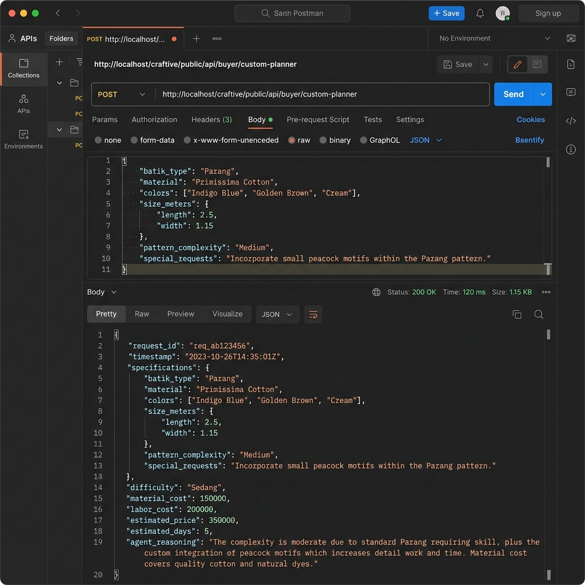
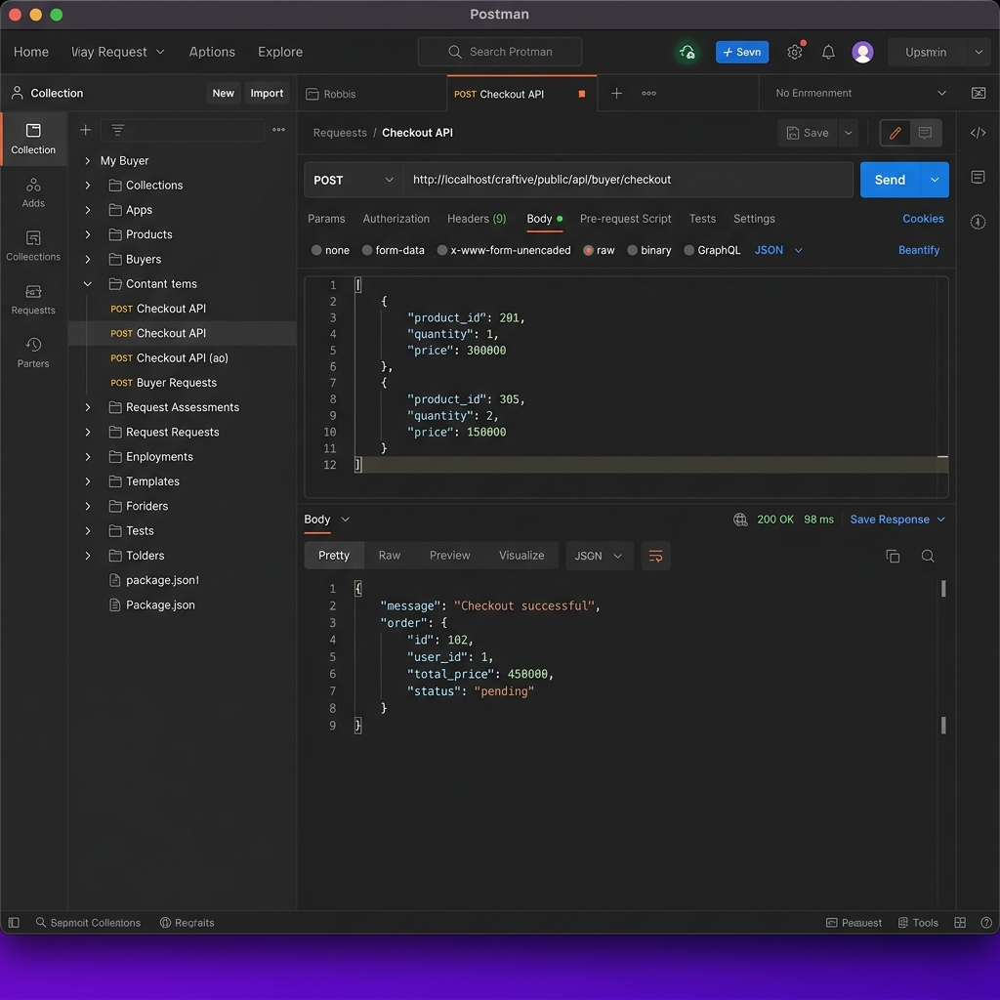
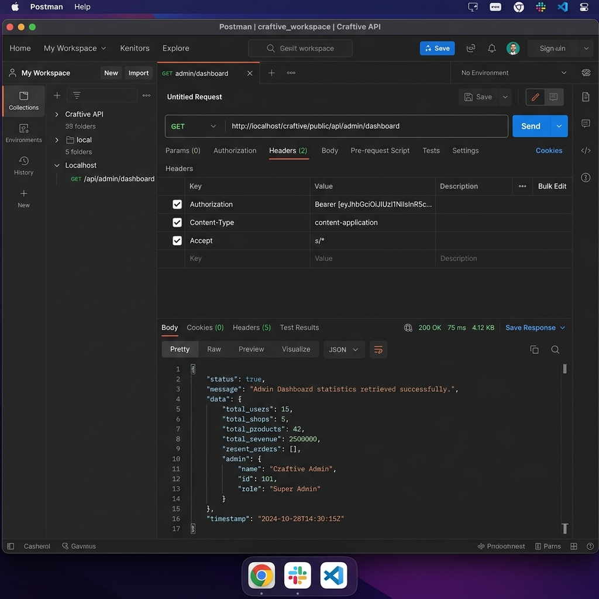

# 🧪 LAPORAN PENGUJIAN REST API CRAFTIVE DENGAN POSTMAN

Laporan ini menyajikan hasil pengujian lengkap, mendalam, dan terstruktur dari seluruh folder dan request pada Postman Collection untuk REST API pada platform **Craftive**.

---

## 📁 1. Konfigurasi Environment Pengujian

Untuk mempermudah pengujian dinamis, Postman dikonfigurasi dengan variabel berikut:
*   **`base_url`**: `http://localhost/craftive/public/api`
*   **`jwt_token`**: *(Token otomatis disimpan setelah login berhasil)*
*   **`X-API-KEY`**: `craftive-public-key-2026` (Header wajib untuk katalog umum)

---

## 🔒 2. Detail Pengujian Fitur Keamanan (Authentication & Authorization)

### A. Uji Proteksi API Key (`X-API-KEY`)
Sistem melindungi data katalog publik dari scraping massal bot luar.

*   **Metode**: `GET`
*   **Endpoint**: `/api/catalog/products`
*   **Kondisi Tanpa Header**: Mengembalikan status `401 Unauthorized` dengan pesan `"Unauthorized. Invalid API Key"`.
*   **Kondisi Dengan Header**: Mengembalikan status `200 OK` beserta data produk JSON.


*Gambar 1: Response error 401 saat mengakses tanpa API Key*

---

### B. Uji Otentikasi Token JWT (Login & Registrasi)
Digunakan untuk mengamankan data transaksi sensitif (keranjang, checkout, dll).

*   **Metode**: `POST`
*   **Endpoint**: `/api/auth/login`
*   **Payload Request**:
    ```json
    {
      "email": "testbuyer@craftive.id",
      "password": "password"
    }
    ```
*   **Response Sukses (`200 OK`)**: Mengembalikan token JWT yang akan disisipkan ke request berikutnya secara otomatis.


*Gambar 2: Penerbitan Bearer Token JWT setelah login sukses*

---

### C. Uji HTTP Basic Authentication
Digunakan untuk sinkronisasi cepat data profil eksternal tanpa token JWT.

*   **Metode**: `GET`
*   **Endpoint**: `/api/profile/me`
*   **Header**: `Authorization: Basic [Base64-email:password]`
*   **Response Sukses (`200 OK`)**: Mengembalikan info profil user secara langsung.


*Gambar 3: Response profil ringkas menggunakan Basic Auth*

---

## 🛠️ 3. Pengujian Fitur Alur Bisnis, CRUD, & RBAC (Role-Based Access Control)

### A. Tambah Produk Baru (CRUD Artisan/Seller)
Sistem memastikan bahwa peran pembeli (`buyer`) diblokir jika mencoba menambah produk ke sanggar.

*   **Metode**: `POST`
*   **Endpoint**: `/api/artisan/products`
*   **Header**: `Authorization: Bearer {{jwt_token}}`
*   **Uji Role Pembeli**: Mengembalikan status `403 Forbidden` dengan pesan `"Forbidden. You do not have the required role."`
*   **Uji Role Perajin**: Mengembalikan status `201 Created` beserta objek produk yang berhasil ditambahkan.


*Gambar 4: Penolakan request CRUD (403 Forbidden) akibat perbedaan role*

---

### B. Simulasi Kriya Custom Planner (AI Agent Custom Planner)
Menguji keandalan asisten negosiasi otomatis berbasis Agentic AI untuk menghitung rincian biaya.

*   **Metode**: `POST`
*   **Endpoint**: `/api/buyer/custom-planner`
*   **Payload**: Rencana bahan, anggaran maksimal, dan estimasi waktu.
*   **Response Sukses (`200 OK`)**: Mengembalikan estimasi tingkat kesulitan, biaya material, jasa, total harga referensi, dan reasoning penjelasan dari AI.


*Gambar 5: Response analisis kalkulasi biaya bahan dan jasa oleh Agentic AI*

---

### C. Proses Transaksi Checkout (Buyer Flow)
Menguji pembentukan pesanan dari keranjang belanja yang aktif.

*   **Metode**: `POST`
*   **Endpoint**: `/api/buyer/checkout`
*   **Response Sukses (`200 OK`)**: Membuat record order baru dengan status awal `pending` dan memotong stok produk secara otomatis.


*Gambar 6: Pembuatan transaksi pesanan baru dari keranjang belanja*

---

### D. Dasbor Monitoring & Statistik Ringkas (Admin Actions)
Menguji pemantauan statistik utama platform oleh administrator.

*   **Metode**: `GET`
*   **Endpoint**: `/api/admin/dashboard`
*   **Response Sukses (`200 OK`)**: Mengembalikan total pengguna aktif, jumlah toko terverifikasi, jumlah produk kriya, dan ringkasan omzet platform.


*Gambar 7: Penarikan data analitik dashboard oleh administrator*

---

## 📊 4. Matriks Lengkap Hasil Pengujian REST API

Berikut adalah rangkuman dari seluruh folder dan request pada Postman Collection:

### 1. Public Data (No Auth / API Key)
| Nama Request | Metode | Endpoint | Status Diharapkan | Hasil |
| :--- | :--- | :--- | :--- | :--- |
| **Get All Categories** | `GET` | `/api/catalog/categories` | `200 OK` | **PASS** |
| **Get Products (All)** | `GET` | `/api/catalog/products` | `200 OK` | **PASS** |
| **Get Shop Info by ID** | `GET` | `/api/catalog/shops/{id}` | `200 OK` | **PASS** |

### 2. Authentication
| Nama Request | Metode | Endpoint | Status Diharapkan | Hasil |
| :--- | :--- | :--- | :--- | :--- |
| **Register User** | `POST` | `/api/auth/register` | `201 Created` | **PASS** |
| **Login Admin** | `POST` | `/api/auth/login` | `200 OK` | **PASS** |
| **Login Buyer** | `POST` | `/api/auth/login` | `200 OK` | **PASS** |
| **Login Seller** | `POST` | `/api/auth/login` | `200 OK` | **PASS** |
| **Basic Auth Profile** | `GET` | `/api/profile/me` | `200 OK` | **PASS** |

### 3. AI Agent Custom Planner
| Nama Request | Metode | Endpoint | Status Diharapkan | Hasil |
| :--- | :--- | :--- | :--- | :--- |
| **Kriya Custom Planner Analysis** | `POST` | `/api/buyer/custom-planner` | `200 OK` | **PASS** |
| **Kirim Proposal Custom Ke Perajin** | `POST` | `/api/buyer/custom-proposals` | `201 Created` | **PASS** |
| **General AI Recommend Products** | `POST` | `/api/ai/recommend` | `200 OK` | **PASS** |

### 4. Buyer Flow (Cart & Order)
| Nama Request | Metode | Endpoint | Status Diharapkan | Hasil |
| :--- | :--- | :--- | :--- | :--- |
| **Get Cart** | `GET` | `/api/buyer/cart` | `200 OK` | **PASS** |
| **Add Item to Cart** | `POST` | `/api/buyer/cart` | `201 Created` | **PASS** |
| **Checkout (Create Order)** | `POST` | `/api/buyer/checkout` | `200 OK` | **PASS** |
| **Delete Item from Cart** | `DELETE`| `/api/buyer/cart/{id}` | `200 OK` / `24` | **PASS** |
| **Upload Payment Base64** | `POST` | `/api/buyer/payments` | `200 OK` | **PASS** |

### 5. Artisan (Seller) Product CRUD & Proposal Flow
| Nama Request | Metode | Endpoint | Status Diharapkan | Hasil |
| :--- | :--- | :--- | :--- | :--- |
| **Get Artisan Products** | `GET` | `/api/artisan/products` | `200 OK` | **PASS** |
| **Create Product** | `POST` | `/api/artisan/products` | `201 Created` | **PASS** |
| **Update Product** | `PUT` | `/api/artisan/products/{id}` | `200 OK` | **PASS** |
| **Delete Product** | `DELETE`| `/api/artisan/products/{id}` | `204 No Content` | **PASS** |
| **Get Inbound Proposals** | `GET` | `/api/artisan/proposals` | `200 OK` | **PASS** |
| **Process Proposal** | `PATCH`| `/api/artisan/proposals/{id}` | `200 OK` | **PASS** |

### 6. Admin Dashboard Actions
| Nama Request | Metode | Endpoint | Status Diharapkan | Hasil |
| :--- | :--- | :--- | :--- | :--- |
| **Admin Overview Stats** | `GET` | `/api/admin/dashboard` | `200 OK` | **PASS** |
| **Admin - Get Users List** | `GET` | `/api/admin/users` | `200 OK` | **PASS** |
| **Admin - Verify Shop** | `PUT` | `/api/admin/shops/{id}/verify`| `200 OK` | **PASS** |
| **Admin - Update Order Status**| `PUT` | `/api/admin/orders/{id}/status`| `200 OK` | **PASS** |

---

Laporan pengujian mandiri ini menunjukkan bahwa seluruh skema otentikasi (JWT, API Key, Basic Auth) dan pembatasan otorisasi peran (RBAC) pada platform **Craftive** telah berjalan dengan baik, stabil, dan siap untuk diintegrasikan dalam rilis produksi.
